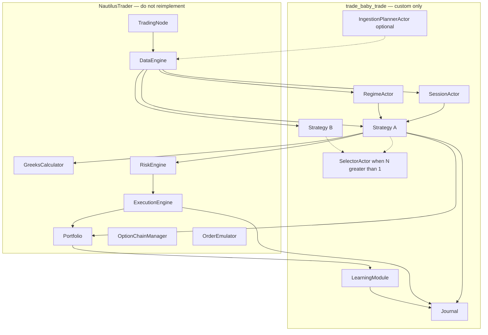
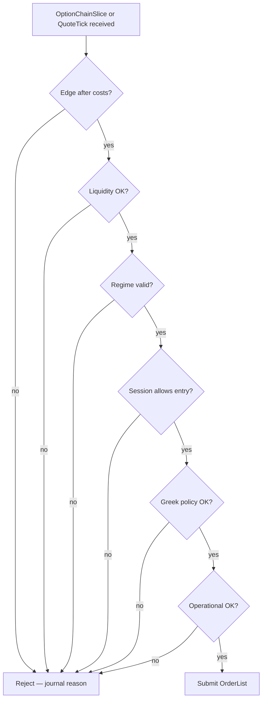
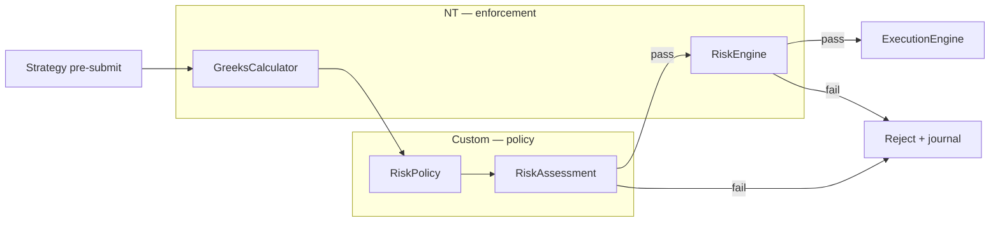
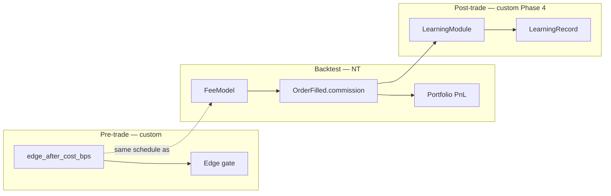
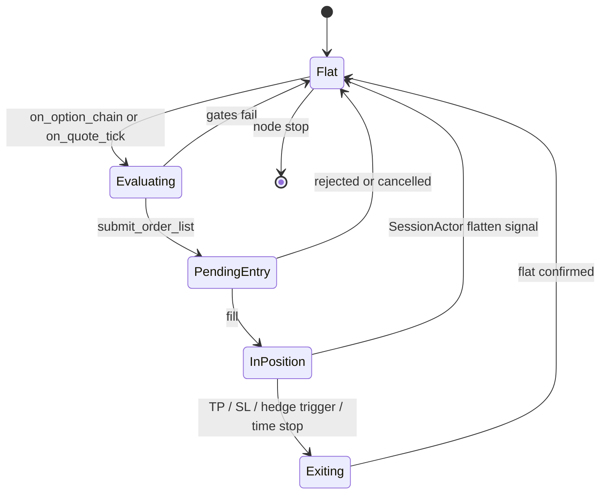

# 0DTE Design — NT-First Architecture (v2)

## What we are building

A **design for institutional-grade 0DTE / near-expiry options trading** as a thin extension layer on [NautilusTrader](https://nautilustrader.io/) 1.228+. The system targets the same operational reality as prop shops and vol desks: **event-driven inventory management on rich options data**, defined-risk structures, layered trade gates, continuous greek monitoring, and active post-entry control — not periodic rebalance on spot OHLCV.

**Primary asset class:** US equity index 0DTE (SPX/SPY via Interactive Brokers). Crypto options (Deribit/OKX/Bybit) are a secondary venue path where NT support is richer (venue-streamed greeks, combos).

**Design-only scope:** This plan defines architecture, boundaries, diagrams, and documentation updates. It does not prescribe implementation steps or file layout.

---

## Design goals

1. **Match institutional 0DTE practice** — continuous cadence, chain-centric data, greek-aware risk, defined-risk structures, cost-aware data fidelity, PnL attribution.
2. **Do not reinvent NautilusTrader** — use NT for the event loop, subscriptions, instruments, greeks, orders, fills, portfolio, and backtest replay.
3. **Keep the custom layer thin** — only what NT lacks: multi-strategy allocation, greek *policy*, regime/session context, human approval, subscription *planning*, and learning attribution.
4. **Live/backtest parity** — the same Strategy classes and subscription model in `TradingNode` and `BacktestNode`, fed from the NT catalog.
5. **Document before build** — all `docs/design/` artifacts must reflect v2 before any code is written.

---

## Design non-goals

- Rebuilding matching, order books, or the event loop
- A parallel ingestion pipeline (`Pipeline`, `IngestionService`, hourly fetch)
- Custom mirrors of NT types (`GreekBook`, `OptionsChainSnapshot`, `MarketSnapshot` for live options)
- Sub-second market making or HFT-style quoting
- Full stochastic vol engines, dealer-gamma/OI pin models, or ML calibration (deferred)
- A Derive/on-chain adapter (not in NT 1.228)

---

## Why v1 failed (and what v2 fixes)

The original design in `[docs/design/](docs/design/)` correctly identified institutional gaps but proposed fixing them by **extending a custom batch pipeline**:

```
Pipeline.run_cycle() → IngestionService.fetch() → IngestedDataset → ProcessPool → ActionEngine
```

That path fights NT's event-driven model and duplicates capabilities NT already provides.


| v1 element                                             | Problem                                          | v2 replacement                                                                    |
| ------------------------------------------------------ | ------------------------------------------------ | --------------------------------------------------------------------------------- |
| `IngestionScheduler` (1h) + `IngestionService.fetch()` | Batch OHLCV pull; wrong cadence for 0DTE         | NT `subscribe_quote_ticks`, `subscribe_option_chain`, `subscribe_option_greeks`   |
| `MarketSnapshot` / proposed `OptionsChainSnapshot`     | Duplicates NT data types                         | Read from NT cache / event handlers                                               |
| `GreekBook` (custom aggregate)                         | Duplicates `GreeksCalculator.portfolio_greeks()` | Call `self.greeks.portfolio_greeks(...)` with shock params                        |
| `TradeStructure` (standalone entity)                   | Orphan from execution                            | Map to `InstrumentId` (`OptionSpread`, IB BAG) + `OrderList`                      |
| `PositionManager` (batch stage)                        | Post-fill management needs event loop            | Strategy handlers + brackets / `OrderEmulator`                                    |
| `Pipeline.run_cycle()`                                 | Parallel orchestrator fighting NT                | `TradingNode.run()`                                                               |
| Custom `RiskManager` only                              | Ignores NT `RiskEngine`; rebuilds greeks         | Greek **policy** in Strategy/Actor; NT `RiskEngine` for notional/rate/qty         |
| `DeriveSource`                                         | No NT adapter in 1.228                           | IB (equity 0DTE), Deribit/OKX (crypto options)                                    |
| ProcessPool `AnalysisEngine` as live path              | Map-reduce for research, not 0DTE hedge loop     | Lightweight Strategy event handlers live; ProcessPool offline-only if ever needed |


---

## Core architectural principle

**NautilusTrader orchestrates; we extend with Actors, Strategies, and thin policy objects inside `TradingNode`.**

No parallel ingestion layer. No parallel greek book. No hourly scheduler driving the live loop.




---

## Two control loops

Institutional 0DTE requires separating concerns by time horizon:


| Loop                         | Owner                             | Cadence                                              | Purpose                                                                                            |
| ---------------------------- | --------------------------------- | ---------------------------------------------------- | -------------------------------------------------------------------------------------------------- |
| **Live loop**                | `TradingNode` event loop          | Event-driven (ticks, greek updates, chain snapshots) | Signal evaluation, greek gates, entry/exit, hedging, flatten rules                                 |
| **Research loop** (optional) | Offline ProcessPool on NT catalog | Batch (hourly/daily)                                 | Heavy factor research, walk-forward calibration, strategy retirement — **never on the order path** |


The v1 design conflated these into one hourly batch cycle. v2 makes the live loop NT-native and demotes batch analysis to optional offline research.

---

## Institutional requirements → design mapping

These gaps from the institutional analysis remain valid. v2 addresses each **inside NT**, not via a custom pipeline.


| Institutional requirement                                      | How v2 satisfies it                                                        |
| -------------------------------------------------------------- | -------------------------------------------------------------------------- |
| **Cadence** — minutes matter on expiry day                     | Event-driven subscriptions + chain `snapshot_interval_ms`, not 1h batch    |
| **Chain-centric data** — strikes, IV, OI, greeks               | `OptionChainSlice`, `OptionGreeks`, `QuoteTick` via NT subscriptions       |
| **Defined-risk structures** — verticals, spreads, condors      | `OptionSpread` / IB BAG `InstrumentId` + `OrderList`                       |
| **Layered trade gates** — edge, liquidity, greek, session, ops | Strategy evaluates gates before `submit_order()`; see below                |
| **Greek-aware risk** — delta/gamma/vega limits, scenarios      | `GreeksCalculator.portfolio_greeks()` + custom `RiskPolicy`                |
| **Post-entry management** — hedge, scale, flatten              | Strategy `on_quote_tick` / `on_option_greeks` + brackets + `OrderEmulator` |
| **PnL attribution** — theta/gamma/vega/slippage, commissions   | Custom `LearningModule` on NT fill events; `OrderFilled.commission`        |
| **Trading fees / commissions** — realistic backtest PnL        | NT `FeeModel` on `BacktestVenueConfig`; live via `OrderFilled.commission`  |
| **Tiered data fidelity** — cost vs freshness tradeoff          | HOT/WARM/COLD mapped to NT subscriptions; optional `IngestionPlannerActor` |
| **Multi-strategy portfolio** — TopN, diversification           | Multiple NT Strategies + optional `SelectorActor`                          |
| **Human vs automation routing**                                | `ActorClassifier` + approval workflow                                      |
| **Audit trail**                                                | Cross-cutting `Journal` on NT events                                       |


---

## Layered trade gates (institutional decision model)

Firms do not trade on a single `certainty` score. Every entry passes **all** gates; default state is **no trade**.




| Gate            | Source                            | Fields / mechanism                                 |
| --------------- | --------------------------------- | -------------------------------------------------- |
| Edge            | Strategy logic                    | `TradeIntent.edge_after_cost_bps` — theoretical edge minus spread, expected slippage, and expected per-leg commissions (aligned with `FeeModel` schedule); see **Trading costs architecture** below |
| Liquidity       | Chain slice quotes                | `TradeIntent.liquidity_score`, spread width, depth |
| Regime          | `RegimeActor`                     | `TradeIntent.regime_tag`                           |
| Session         | `SessionActor`                    | Blackout windows, minutes-to-expiry, event flags   |
| Greek           | `GreeksCalculator` + `RiskPolicy` | `portfolio_greeks()` + scenario shocks             |
| Operational     | NT + config                       | Trading state, margin, feed health                 |
| Basic pre-trade | NT `RiskEngine`                   | Notional, rate limits, qty/price validation        |


---

## NT ownership (use directly — do not rebuild)


| Concern                  | NT API / type                                                       | Notes                                                                            |
| ------------------------ | ------------------------------------------------------------------- | -------------------------------------------------------------------------------- |
| Live loop                | `TradingNode`, `Actor`, `Strategy`                                  | Strategies inherit `Actor`; `.greeks` → `GreeksCalculator`                       |
| Option chain             | `subscribe_option_chain()`, `on_option_chain()`, `OptionChainSlice` | Snapshot mode = WARM tier (`snapshot_interval_ms`); raw mode = HOT               |
| Per-leg greeks           | `OptionGreeks`, `subscribe_option_greeks()`, `on_option_greeks()`   | Venue-streamed (Deribit/Bybit/OKX) or local BS via calculator                    |
| Portfolio greeks         | `GreeksCalculator.portfolio_greeks()` → `PortfolioGreeks`           | `spot_shock`, `vol_shock`, `time_to_expiry_shock`, beta weighting                |
| Instruments              | `OptionContract`, `OptionSpread`, `CryptoOptionSpread`              | IB BAG: load legs → `new_generic_spread_id()` → `request_instrument()`           |
| Multi-leg orders         | `OrderList`, `SubmitOrderList`                                      | Atomic spread submission                                                         |
| Contingent orders        | `order_factory.bracket()`, OCO/OTO via `OrderManager`               | Profit target, stop loss, time stops                                             |
| Emulated triggers        | `OrderEmulator`                                                     | Stops/trailing when venue lacks native support                                   |
| Execution algos          | `ExecAlgorithm` (e.g. TWAP)                                         | Scale in/out without blowing spreads                                             |
| Pre-trade (basic)        | `RiskEngine`                                                        | Notional, rate limits, qty/price validation, trading state — **not greek-aware** |
| Portfolio / fills        | `Portfolio`, position events, `OrderFilled`                         | PnL, margin; `OrderFilled.commission` on every fill                            |
| Trading fees (backtest)  | `FeeModel` on `BacktestVenueConfig` (`FixedFeeModel`, `MakerTakerFeeModel`, or custom) | `get_commission(order, fill_qty, fill_px, instrument)` → `OrderFilled.commission`; **not** configured on live `TradingNode` (venue passes through) |
| Backtest parity          | `BacktestNode` + catalog                                            | Same `OptionChainManager` path as live; same `FeeModel` schedule as edge gate uses for pre-trade estimates |
| Rates / divs             | `YieldCurveData` in cache                                           | Fallback `flat_interest_rate` in calculator                                      |
| Custom context transport | NT custom data types + `subscribe_data()`                           | `RegimeTag`, session phase published by Actors                                   |


---

## Custom extension layer (what we design and build)

Only components NT does not provide:


| Component                                     | Purpose                                                                                             | Introduce when                                |
| --------------------------------------------- | --------------------------------------------------------------------------------------------------- | --------------------------------------------- |
| `**Strategy` subclasses**                     | Signal logic, structure selection, gate evaluation, entry/exit/hedge                                | Core — required from day one                  |
| `**RiskPolicy`** (value object)               | max_net_delta, max_daily_loss, strike concentration — **policy**, not calculator                    | Core — with first strategy                    |
| `**TradeIntent`** (value object)              | edge_bps, liquidity_score, regime_tag, target `InstrumentId` — **intent**, not parallel order model | Core — replaces `StrategySignal.option: Side` |
| `**SessionActor`**                            | Blackout windows, session phase, minutes-to-expiry                                                  | Early — cross-cutting context                 |
| `**RegimeActor**`                             | Rule-based chop/trend/pin_risk tags                                                                 | Early — gate input                            |
| `**SelectorActor` + `DiversificationPolicy**` | TopN across N strategies, capital allocation                                                        | When N > 1 strategies compete for capital     |
| `**IngestionPlannerActor**`                   | Cost-aware subscription plan (which series/strikes to subscribe)                                    | When API budget becomes a constraint          |
| `**ActorClassifier` + human approval**        | Auto vs human routing for large/risky trades                                                        | When live capital at scale                    |
| `**LearningModule`**                          | PnL attribution (theta/gamma/vega/slippage, commission), `edge_predicted_bps` vs `edge_realized_bps` calibration | When fills accumulate for feedback            |
| `**Journal**`                                 | Cross-cutting audit on every gate, order, fill                                                      | Core — from day one                           |


**Never implement as standalone systems:**

- `GreekBook`, `OptionsChainSnapshot`, `VolSurfaceSnapshot`
- `IngestionService` / `DataSource.fetch()` for live trading
- `Pipeline` / `IngestionScheduler` / `PipelineScheduler` as live orchestrator
- `OrderTicket` wrapper (use NT `Order` directly)
- `PortfolioState.gross_exposure_pct` as primary risk metric for options
- Batch `PositionManager` as a pipeline stage

---

## Risk architecture (layered, not duplicated)




| Layer                   | Responsibility                                           | Example limits                                                             |
| ----------------------- | -------------------------------------------------------- | -------------------------------------------------------------------------- |
| **NT `RiskEngine`**     | Hard engine checks on every order                        | Max notional, order rate, qty/price bounds, trading state                  |
| **Custom `RiskPolicy`** | Greek and desk rules evaluated in Strategy before submit | max_net_delta, max_net_gamma, max_daily_loss, max_concentration_per_strike |
| `**GreeksCalculator**`  | Compute current and projected greeks + scenario shocks   | `spot_shock=±0.01`, `vol_shock=0.10`                                       |
| **Post-entry**          | Continuous monitoring in Strategy handlers               | Delta band breach → hedge; time stop → flatten                             |


NT `RiskEngine` is always on. Custom greek policy is an additional gate, not a replacement.

---

## Trading costs architecture (FeeModel + edge gate)

Three related layers — do **not** conflate API subscription cost (HOT/WARM/COLD) with trading commissions.

| Layer | Owner | Mechanism | Purpose |
| --- | --- | --- | --- |
| **Pre-trade edge** | Strategy (`build_intent`) | `TradeIntent.edge_after_cost_bps` | Theoretical edge minus half-spread, expected slippage, and **expected per-leg commissions** before submit |
| **Backtest accounting** | NT `FeeModel` on `BacktestVenueConfig` | `FixedFeeModel`, `MakerTakerFeeModel`, or custom IB options schedule | Apply commissions on fills so `Portfolio` PnL and backtest attribution are realistic |
| **Live accounting** | NT adapter + `Portfolio` | `OrderFilled.commission` from venue | No `FeeModel` on `TradingNode` — IB reports actual commissions |
| **Post-trade attribution** | `LearningModule` (Phase 4) | `OrderFilled.commission` + slippage vs mid | Decompose realized edge; compare `edge_predicted_bps` vs `edge_realized_bps` |

**Alignment rule:** The fee schedule used in `edge_after_cost_bps` pre-trade estimates must match the `FeeModel` wired in `BacktestVenueConfig` (and documented per venue in config). Otherwise the edge gate and backtest PnL diverge.



**NT types (do not reimplement):**

- `nautilus_trader.backtest.models.fee.FeeModel` — abstract; `get_commission(order, fill_qty, fill_px, instrument) -> Money`
- `FixedFeeModel` — per-fill fixed commission (e.g. per-contract IB options fee)
- `MakerTakerFeeModel` — notional-based maker/taker schedule (crypto venues)

**Custom-only (Phase 4):**

- `configs/fees/*.yaml` — venue fee schedule (per-contract, per-leg multiplier for spreads)
- `LearningRecord.commission` (or derive from fill events) — separate from `slippage_bps` in attribution
- `docs/implementation/learning-attribution.md` — document how commission enters `edge_realized_bps`

**Phase 3 placeholder (known gap):** Early strategies may stub `edge_after_cost_bps` (e.g. `max(min_edge_after_cost_bps, 10.0)`). Phase 4 replaces stub with quote-derived cost math and wires `FeeModel` in `build_backtest_node()`.

---

## Strategy lifecycle (per strategy, not global batch)

Each Strategy owns its state machine. There is no global `Idle → Ingesting → Analyzing → Acting` cycle.




**SessionActor** publishes blackout (e.g. T-30m to close) → strategies in `Flat` reject new entries; strategies `InPosition` may still manage/flatten.

---

## End-to-end live flow (sequence design target)

What `sequence-diagram.puml` must depict:

1. `TradingNode` start → instrument provider loads 0DTE chain (IB `build_options_chain`)
2. Strategy `subscribe_quote_ticks(underlying)` + `subscribe_option_chain(series_id, snapshot_interval_ms=60_000)`
3. `on_option_chain(slice)` → layered gates → build spread `InstrumentId`
4. `self.greeks.portfolio_greeks(...)` → `RiskPolicy` check
5. `submit_order_list()` → NT `RiskEngine` → `ExecutionEngine`
6. `on_quote_tick` / `on_option_greeks` / fill → bracket adjust, hedge, or flatten
7. `LearningModule.observe(fill)` → `Journal`

---

## Data model scope

**Custom types only** (everything else references NT):


| Keep                    | Purpose                                                                   |
| ----------------------- | ------------------------------------------------------------------------- |
| `TradeIntent`           | Proposed trade with gate fields + target `InstrumentId`                   |
| `RiskPolicy`            | Configurable greek and loss limits                                        |
| `RiskAssessment`        | Gate result: pass/fail, breached rules, projected greeks                  |
| `DiversificationPolicy` | TopN caps per instrument/strategy/gross risk                              |
| `LearningRecord`        | PnL attribution: theta, gamma, vega, slippage, commission, edge_realized vs predicted |
| `JournalEntry`          | Audit record cross-cutting all stages                                     |
| `ActorKind` + enums     | Human vs automation routing                                               |


| Remove — NT owns                                       | NT replacement                              |
| ------------------------------------------------------ | ------------------------------------------- |
| `MarketSnapshot`, `IngestedDataset`, `IngestionWindow` | `QuoteTick`, `OptionChainSlice`, cache      |
| `OrderTicket`, `PortfolioState`                        | NT `Order`, `Portfolio`, position events    |
| `StrategySignal.option: Side`                          | `TradeIntent` with structure `InstrumentId` |


---

## Ingestion tiers (cost vs fidelity)

Mapped to NT subscriptions — not custom fetch. Detailed defaults in `[docs/design/ingestion-tiers.md](docs/design/ingestion-tiers.md)` (to be created).


| Tier     | NT mechanism                                                                                           | Default use                                     |
| -------- | ------------------------------------------------------------------------------------------------------ | ----------------------------------------------- |
| **HOT**  | `subscribe_quote_ticks(underlying)`; raw `subscribe_option_chain` or per-leg `subscribe_option_greeks` | Underlying + open position legs                 |
| **WARM** | `subscribe_option_chain(snapshot_interval_ms=60_000–300_000)`                                          | ATM ± N strikes for signal generation           |
| **COLD** | IB `build_options_chain` on demand; catalog backfill                                                   | Full chain / OI, pin research, offline analysis |


Optional `IngestionBudget` constrains what `IngestionPlannerActor` subscribes to — not how NT fetches.

### Default subscription profile (0DTE)


| Concern         | NT subscription                                         | Rationale                             |
| --------------- | ------------------------------------------------------- | ------------------------------------- |
| Underlying      | `subscribe_quote_ticks`                                 | Delta band / hedge triggers           |
| Chain (signals) | `subscribe_option_chain`, `snapshot_interval_ms=60_000` | Vol/skew without tick-rate full chain |
| Full chain      | On-demand instrument load                               | Pin research, not every evaluation    |
| Open positions  | `subscribe_option_greeks` per leg                       | Risk gate on every greek update       |
| Hedge check     | `on_quote_tick` on underlying                           | Gamma management                      |
| New entries     | Blocked by `SessionActor` T-30m to close                | Pin / assignment risk                 |


---

## Venue matrix


| Venue                     | NT adapter          | 0DTE role                         | Notes                                                                           |
| ------------------------- | ------------------- | --------------------------------- | ------------------------------------------------------------------------------- |
| **Interactive Brokers**   | Yes                 | **Primary** — SPX/SPY equity 0DTE | Chain build, BAG spreads, local greeks via calculator; no venue-streamed greeks |
| **Deribit / OKX / Bybit** | Yes                 | Secondary — crypto options 0DTE   | Venue-streamed `OptionGreeks`, IV orders, combos                                |
| **Binance**               | Yes                 | Spot/perp hedging only            | Not US equity options                                                           |
| **Derive**                | **In Beta** (1.228) | Proceed with caution              | Was in v1 README — drop or flag explicitly                                      |


---

## Multi-strategy model


| Stage                             | Approach                                                                                                                 |
| --------------------------------- | ------------------------------------------------------------------------------------------------------------------------ |
| **One strategy**                  | Single NT Strategy; full capital; no selector needed                                                                     |
| **Two+ strategies, uncorrelated** | Fixed capital split in config; each Strategy owns its greek budget                                                       |
| **Two+ strategies, competing**    | `SelectorActor` on MessageBus: collects `TradeIntent`s, applies `DiversificationPolicy` TopN, publishes approved intents |
| **Heavy offline research**        | ProcessPool over NT catalog snapshots — parallel to live, never blocking the event loop                                  |


Keep v1's scatter/reduce/join barrier **only** for offline research. Live strategies are lightweight event handlers.

---

## Concurrency model


| Domain                       | Model                                                                                                 |
| ---------------------------- | ----------------------------------------------------------------------------------------------------- |
| **Live trading**             | Single-threaded NT event loop per node; Strategies and Actors are concurrent components on MessageBus |
| **Offline research**         | ProcessPool map-reduce over catalog — optional, separate from live                                    |
| **Multi-strategy selection** | `SelectorActor` join barrier only when N strategies compete for shared capital                        |


---

## What to defer

- Dealer gamma / OI pin models
- Full vol surface fitting (use chain slice + `OptionGreeks` IV fields)
- Sub-second market making
- ML in `LearningModule` (rule calibration first)
- `IngestionPlannerActor` until IB API cost is measured
- ProcessPool on the live order path
- Derive adapter
- Any custom rebuild of NT primitives listed above

---

## Validation summary


| Area           | v1 design                           | v2 (NT-first)                                     | Doc action                                   |
| -------------- | ----------------------------------- | ------------------------------------------------- | -------------------------------------------- |
| Control loop   | 1h `Pipeline.run_cycle()`           | `TradingNode` event loop                          | Redesign state + sequence diagrams           |
| Market data    | `MarketSnapshot` fetch              | `OptionChainSlice`, `OptionGreeks`, `QuoteTick`   | Reference NT types; delete parallel entities |
| Structures     | `TradeStructure` entity             | `OptionSpread` / BAG `InstrumentId` + `OrderList` | Map in data model                            |
| Greek risk     | Custom `GreekBook`                  | `GreeksCalculator` + `RiskPolicy`                 | Layered risk section in README               |
| Basic risk     | Custom `RiskManager`                | NT `RiskEngine` + greek policy in Strategy        | Class diagram boundary                       |
| Post-entry     | Batch `PositionManager`             | Strategy handlers + brackets + `OrderEmulator`    | State diagram lifecycle                      |
| Multi-strategy | ProcessPool + `ResultSelector` live | Multiple Strategies + optional `SelectorActor`    | Concurrency diagram                          |
| Backtest       | Underspecified                      | Catalog + same Strategy in `BacktestNode`         | README section                               |
| Venues         | IB / Binance / Derive               | IB 0DTE; crypto via Deribit/OKX; no Derive        | Venue matrix in README                       |
| Learning       | PnL vs certainty                    | Attribution on NT fill events + `OrderFilled.commission` | Extend `LearningRecord`; `learning-attribution.md` |
| Trading fees   | Not specified                       | NT `FeeModel` (backtest) + edge gate alignment    | `configs/fees/`; NT mapping table row        |
| Trade decision | `certainty` + `risk_pct`            | Layered gates → `TradeIntent`                     | Sequence diagram + data model                |


---

## Documentation update plan

All changes target `[docs/design/](docs/design/)` only.

### README.md

- Replace "hourly quant-trading pipeline" with **"NT-first 0DTE extension layer"**
- Add design goals, non-goals, and NT mapping table (include `FeeModel` row)
- Add venue matrix and two-loop explanation
- Add layered trade gates section and **trading costs architecture** (`FeeModel` + edge gate alignment)
- Default cadence via NT subscriptions (link to ingestion-tiers.md)

### class-diagram.puml

**Remove or demote:** `Pipeline`, `IngestionScheduler`, `IngestionService`, `DataSource`, `AnalysisEngine`, `ProcessPoolStrategyExecutor`, `ActionEngine`, `Executor`, `PortfolioManager`, `RiskManager` (as standalone service).

**Add:**

```
TradingNode
  ├── SessionActor, RegimeActor, [IngestionPlannerActor]
  ├── StrategyA..N (NT Strategy subclasses)
  ├── [SelectorActor] — optional
  └── LearningModule

NT engine boundary:
  DataEngine, GreeksCalculator, RiskEngine, ExecutionEngine,
  Portfolio, OrderEmulator, OptionChainManager
```

**Keep:** `DiversificationPolicy`, `ActorClassifier`, `HumanApprovalHandler`, `LearningModule`, `Journal`.

### sequence-diagram.puml

Replace hourly batch flow with the end-to-end live flow described above.

### state-diagram.puml

Per-strategy lifecycle (`Flat → Evaluating → PendingEntry → InPosition → Exiting → Flat`) plus SessionActor blackout interaction. Drop global batch cycle states.

### data-model.puml

Trim to custom-only types; annotate NT replacements for removed entities.

### concurrency-activity.puml

Live path: NT event loop. Offline research: ProcessPool note (optional, not live). SelectorActor barrier when N > 1.

### ingestion-tiers.md (new)

HOT/WARM/COLD → NT subscription mapping, cost/fidelity tradeoffs, suggested defaults per venue.

---

## Doc update checklist


| File                                                                             | Action                                                                   |
| -------------------------------------------------------------------------------- | ------------------------------------------------------------------------ |
| `[docs/design/README.md](docs/design/README.md)`                                 | Rewrite around NT-first; goals; mapping table; venue matrix; trade gates |
| `[docs/design/class-diagram.puml](docs/design/class-diagram.puml)`               | TradingNode-centric; delete batch pipeline classes                       |
| `[docs/design/state-diagram.puml](docs/design/state-diagram.puml)`               | Strategy lifecycle + SessionActor blackout                               |
| `[docs/design/sequence-diagram.puml](docs/design/sequence-diagram.puml)`         | Subscription → gates → order → hedge flow                                |
| `[docs/design/data-model.puml](docs/design/data-model.puml)`                     | Trim to custom-only types; reference NT for rest                         |
| `[docs/design/concurrency-activity.puml](docs/design/concurrency-activity.puml)` | NT event loop live; ProcessPool offline-only                             |
| `[docs/design/ingestion-tiers.md](docs/design/ingestion-tiers.md)`               | **New** — tier → NT subscription mapping                                 |


