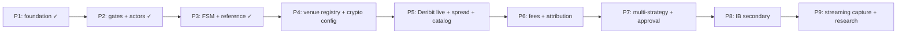

# 0DTE Implementation Plan

## Context

Design v2 in [`docs/design/`](docs/design/) is complete. **Phases 1–3 are delivered** — venue-agnostic gates, actors, FSM, journal, and reference strategy plumbing on `BacktestNode` / `TradingNode`.

**Primary goal:** Trade **crypto 0DTE options**. Venue priority:

1. **Deribit** (first) — NT adapter, venue-streamed greeks, combos/IV orders
2. **Interactive Brokers** (second) — equity index 0DTE (SPX/SPY), BAG spreads, local greeks
3. **Later (not soon):** Binance (perp hedge only), OKX/Bybit; **Derive** explicitly out of scope until NT adapter is stable

**Principle:** NautilusTrader orchestrates; we extend with Actors, Strategies, and thin policy objects. Do **not** build parallel ingestion, greek books, or batch pipelines.

**Dual-node constraint (unchanged):** Shared Strategy/Actor code runs on **both** `BacktestNode` and `TradingNode`. Venue-specific logic lives in config profiles + factory adapter registry + strategy structure selectors — not in gates, journal, or FSM.

### Refactoring scope (Phases 4+)

Phases 1–3 built a **venue-agnostic core** (~80% of custom code). The crypto-first pivot is a **moderate integration refactor**, not a rewrite:

| Keep as-is | Change / add |
| --- | --- |
| Gates, `RiskPolicy`, journal, FSM, actors (pattern) | `node/adapters/` venue registry |
| `TradeIntent`, models, config layering | `DeribitConfig`, crypto session YAML |
| CLI commands (`backtest`, `paper`, `journal`) | `paper_btc.yaml` as default profile |
| Unit tests for gates/models/actors | Deribit catalog fixture + integration tests |
| — | `strategies/selectors/` for combo vs BAG spreads |
| — | `MakerTakerFeeModel` (Phase 6) before `FixedFeeModel` (Phase 8) |

---

## Delivery philosophy — vertical slices

Each phase must produce **observable, grep-able output** (journal lines), not only importable modules. Avoid long periods where code compiles but nothing can be audited.



**Correlation ID:** Every journal entry carries `ref_id` (= `TradeIntent.intent_id` once intents exist) plus `strategy_id`. Propagate through gate failures, order submit, and fills so traders and PnL checkers can trace one decision end-to-end.

---

## Architecture


### Gate architecture boundary (critical)

The greek gate **cannot** live entirely inside a pure evaluator — it requires NT's `GreeksCalculator`. Split responsibilities explicitly:

| Layer | Module | Pure? | Responsibility |
| --- | --- | --- | --- |
| Pre-greek gates | `gates/evaluator.py` → `evaluate_pre_greek()` | **Yes** | edge → liquidity → regime → session → operational |
| Greek snapshots | `BaseZeroDteStrategy` | No | `self.greeks.portfolio_greeks(spot_shock=..., vol_shock=...)` |
| Greek policy | `gates/evaluator.py` → `RiskPolicy.check()` | **Yes** | Limit math on `current_greeks` + `projected_greeks` snapshots |
| NT pre-trade | NT `RiskEngine` | No | notional, rate, qty/price — always on, not reimplemented |
| Trading fees (backtest) | NT `FeeModel` on `BacktestVenueConfig` | No | `FixedFeeModel` / `MakerTakerFeeModel` / custom; populates `OrderFilled.commission` |
| Pre-trade edge costs | Strategy `build_intent` | **Yes** (estimate) | `edge_after_cost_bps` = theoretical edge − spread − expected slippage − expected commissions (schedule must match `FeeModel`) |

**Strategy orchestration pattern:**

```
intent = build_intent(slice)
result = evaluate_pre_greek(intent, context)   # pure
if not result.passed: journal + return
projected = self.greeks.portfolio_greeks(...)  # NT
assessment = RiskPolicy.check(projected, ...)    # pure
if not assessment.passed: journal + return
submit_order_list(...)                         # NT RiskEngine → ExecutionEngine
```

Document this split in `docs/implementation/gate-boundary.md` (short ADR) before Phase 2 gate work.

### Operational gate checklist

Define in `config/schema.py` before implementing Phase 2 gates:

| Check | Source | Default |
| --- | --- | --- |
| Trading state active | NT node / config | Must be `ACTIVE` |
| Underlying quote freshness | Last `QuoteTick` ts vs now | &lt; 30s (configurable) |
| Chain snapshot freshness | Last `OptionChainSlice` ts vs now | &lt; WARM interval + buffer |
| Daily loss budget | Desk rule from `RiskPolicy` | Optional; block new entries if breached |
| Feed / adapter health | NT adapter status | Fail closed if disconnected |

Default: **no trade** until all checks pass. Each failure → `Journal.record(GateStage.OPERATIONAL, reason)`.

---

## Package layout

Introduce a standard `src/` layout and register the package in [`pyproject.toml`](pyproject.toml):

```
src/nautilus_zerodte/
  __init__.py
  models/           # Pydantic value objects from data-model.puml
    enums.py
    trade_intent.py
    risk.py
    journal.py
    learning.py
    diversification.py
  journal/          # Journal service (cross-cutting audit)
    service.py      # in-memory + JSONL append sink
  gates/            # Pure gate logic (testable)
    evaluator.py    # evaluate_pre_greek(), RiskPolicy.check()
    context.py      # GateContext value object (session, regime, ops flags)
  actors/
    session.py      # SessionActor
    regime.py       # RegimeActor
    selector.py     # Phase 7 — SelectorActor
    ingestion.py    # Phase 9 — IngestionPlannerActor
  strategies/
    base.py         # NT Strategy subclass + lifecycle FSM
    reference.py    # ReferenceZeroDteStrategy
    selectors/      # Phase 5 — venue-specific structure selection (deribit.py, ib.py)
    skeleton.py     # Phase 1 — on_start/on_stop journal only
  approval/         # Phase 7
    classifier.py
    handlers.py
  learning/         # Phase 6
    module.py
  config/
    schema.py       # Pydantic config models
    loader.py       # YAML overlay merge + env
  node/
    factory.py      # build_trading_node / build_backtest_node
    adapters/       # Phase 4 — venue adapter registry (deribit.py, ib.py)
    streaming.py    # Phase 9 — StreamingFeatherWriter attach + convert hook
  cli/
    main.py         # typer: backtest, paper, journal, catalog convert (Phase 9)
tests/
  unit/             # gates, models, risk policy, actors, adapters
  integration/      # BacktestNode smoke; TradingNode config smoke
  fixtures/
    catalog/        # SPY slice (legacy Phase 1–3)
    catalog_deribit/  # Phase 5 — BTC/ETH options catalog slice
  base.yaml                 # venue, logging, journal path
  fees/
    deribit_options.yaml    # maker/taker schedule (Phase 6 — primary)
    ib_options.yaml         # per-contract schedule (Phase 8 — secondary)
  risk/
    conservative.yaml       # policy maker owned
    default.yaml
  session/
    crypto_deribit.yaml     # daily expiry blackout (Phase 4 — primary)
    us_equity.yaml          # blackout T-30m (Phase 8 — secondary)
  strategies/
    reference.yaml          # strategy params, underlying + option_series_id
  profiles/
    paper_btc.yaml          # default operator profile (Phase 4 — primary)
    backtest_btc.yaml       # Deribit catalog backtest (Phase 5)
    paper_spy.yaml          # IB equity profile (Phase 8 — secondary)
  streaming/
    default.yaml            # Phase 9 — feather paths, include_types, rotation (off by default)
docs/
  implementation/
    gate-boundary.md        # ADR: pure vs NT greek gate split
    learning-attribution.md # Phase 4 spike — theta/gamma/vega decomposition + commission/slippage vs edge
```

**Naming:** Python package `nautilus_zerodte` (underscore); CLI entry `nautilus-zerodte`.

### Config layering (persona-friendly)

`loader.py` merges overlays in order: `base.yaml` → `risk/*.yaml` → `session/*.yaml` → `strategies/*.yaml` → profile file.

| Persona | Edits | Example path |
| --- | --- | --- |
| Policy maker | Greek limits, shocks, daily loss | `configs/risk/conservative.yaml` |
| Strategy maker | Underlying, structure params, edge thresholds | `configs/strategies/reference.yaml` |
| Trader / operator | Profile selection, dry-run, journal path | `configs/profiles/paper_btc.yaml` |
| Coder | Factory wiring, venue adapter, strategy registration | `node/factory.py`, `node/adapters/`, `config/schema.py` |

Journal payload includes `risk_policy_version` (hash or semver string) so policy changes are auditable in backtests.

---

## Phase 1 — Foundation, dual-node skeleton, first observable slice ✓

**Status: completed 2026-06-21.**

**Goal:** Importable package, data model, **JSONL journal**, layered config, dual node factories with **stubs**, catalog smoke test, operator CLI basics.

**Vertical slice proof:** Run `backtest` → JSONL contains `NODE_START`, `NODE_STOP`, `STRATEGY_START` from skeleton strategy.

### 1.1 Project scaffolding

- Add `[project.scripts]` and `[tool.hatch.build.targets.wheel]` / package discovery in [`pyproject.toml`](pyproject.toml).
- Add **dev dependencies now** (CI already runs `uv sync --group dev`): `pytest`, `ruff`.
- Pin NautilusTrader to a **specific patch** after first green build (e.g. `nautilus-trader==1.228.x`); document upgrade process.
- Validate **Python 3.14** wheel availability on macOS + CI Linux before Phase 1 closes; fall back to 3.13 only if blocked.
- Extend [`Makefile`](Makefile): `lint`, `test`, `backtest`, `paper`.
- Extend [`.github/workflows/ci.yml`](.github/workflows/ci.yml): ruff + pytest unit tests + BacktestNode integration smoke (no IB credentials).
- Document env vars in [`.env.example`](.env.example): `IB_HOST`, `IB_PORT`, `IB_CLIENT_ID` (names only; no values).

### 1.2 Catalog fixture spike (Phase 1 — not deferred)

BacktestNode smoke is on the critical path. Deliver one of:

- **Preferred:** Minimal committed catalog slice under `tests/fixtures/catalog/` (small, no secrets), sufficient for node start + skeleton strategy lifecycle.
- **Alternative:** `scripts/download_catalog_fixture.sh` + CI cache; document in `tests/fixtures/catalog/README.md`.

Integration test in Phase 1: `build_backtest_node(config, catalog_path) → run → exit cleanly`.

### 1.3 Custom data model ([`data-model.puml`](docs/design/data-model.puml))

Implement as immutable Pydantic v2 models:

| Type | Key fields | Notes |
| --- | --- | --- |
| `ActorKind`, `RegimeTag`, `GateStage` | enums | From data model; add `LIFECYCLE`, `FILL`, `PNL` journal stages for ops |
| `TradeIntent` | `intent_id`, `strategy_id`, `instrument_id` (str), gate fields, `projected_greeks`, `rationale` | Store NT `InstrumentId` as string; convert at Strategy boundary |
| `RiskPolicy` | limits + `spot_shock` / `vol_shock` + optional `version` | Value object only — no greek math |
| `RiskAssessment` | `passed`, `breached_rules`, greek snapshots | Output of `RiskPolicy.check()` |
| `DiversificationPolicy` | TopN caps | Phase 4 |
| `JournalEntry` | `entry_id`, `ts`, `stage`, `ref_id`, `strategy_id`, `level`, `payload` | Cross-cutting audit |
| `LearningRecord` | PnL attribution fields | Phase 4 full attribution |

**Explicitly do not implement:** `MarketSnapshot`, `GreekBook`, `OptionsChainSnapshot`, `IngestionService`, `Pipeline`.

### 1.4 Journal (durable from day one)

- `Journal.record(stage, ref_id, payload, strategy_id=...)` → append-only in-memory store **and** JSONL file sink (config: `journal.path`, default `runs/<timestamp>.jsonl`).
- Structured fields on every line: `ts`, `stage`, `ref_id`, `strategy_id`, `level`, `payload`.
- Phase 1 records: node lifecycle, skeleton strategy start/stop.
- Phases 2–3 add: gate pass/fail, state transitions, orders, fills, minimal PnL.

Optional Phase 4 refactor: extract `JournalActor` on MessageBus when SelectorActor adds multi-strategy fan-in. Start with injected service.

### 1.5 Config

- Layered YAML schema (see layout above): venue (IB), underlying, subscription profile ([`ingestion-tiers.md`](docs/design/ingestion-tiers.md) defaults), `RiskPolicy`, session blackout (T-30m), `dry_run`, `journal.path`.
- `loader.py`: merge overlays, overlay env vars, validate with Pydantic.

### 1.6 Node factory (dual-node, stubs)

[`node/factory.py`](src/nautilus_zerodte/node/factory.py) exposes:

- `build_backtest_node(config, catalog_path) -> BacktestNode`
- `build_trading_node(config) -> TradingNode` — IB adapter config from env

**Phase 1 registers (stubs only):**

- `SkeletonZeroDteStrategy` — journals `on_start` / `on_stop`; no subscriptions or orders
- No `SessionActor` / `RegimeActor` yet (added Phase 2)
- Shared `Journal` instance injected into strategy

Factory contract is stable: Phases 2–3 swap stubs for real actors/strategies without changing CLI signatures.

**NT wiring (do not reimplement):** `DataEngine`, `GreeksCalculator`, `RiskEngine`, `ExecutionEngine`, `Portfolio`, `OrderEmulator`, `OptionChainManager` — configured via NT APIs only.

### 1.7 CLI skeleton + operator affordances

```bash
nautilus-zerodte backtest --config configs/profiles/paper_spy.yaml --catalog tests/fixtures/catalog
nautilus-zerodte paper   --config configs/profiles/paper_spy.yaml   # reads IB_* from env
nautilus-zerodte backtest ... --dry-run   # evaluate only; no order submit (wired in Phase 3; flag accepted in Phase 1)
nautilus-zerodte journal summary --path runs/latest.jsonl   # gate rejection counts, last events (Phase 1: lifecycle only; expands each phase)
```

Phase 1: `--dry-run` flag parsed and passed to config; skeleton ignores it. Phase 3: strategy respects it (journal intent, skip submit).

**Kill switch (stub in Phase 1, real in Phase 3):** Document `nautilus-zerodte flatten --config ...` as future emergency flatten-all; Phase 1 CLI prints "not yet implemented" or no-ops with journal entry.

---

## Phase 2 — Actors + pure gate pipeline ✓

**Status: completed 2026-06-21.**

**Goal:** Cross-cutting context on MessageBus; **unit-tested pure gates**; SessionActor blackout provable via journal in backtest.

**Vertical slice proof:** Backtest run → JSONL shows `SESSION` gate rejection during T-30m blackout window (or simulated clock).

### 2.0 Implementation ADR

Write `docs/implementation/gate-boundary.md` before coding gates (see Gate architecture boundary above).

### 2.1 SessionActor ([`class-diagram.puml`](docs/design/class-diagram.puml))

NT `Actor` subclass publishing custom data (NT `DataType` wrapper for session phase):

- `blackout_windows`, `minutes_to_expiry()`, `session_phase()`, `allows_entry()`, `flatten_signal()`
- Default: block new entries T-30m to close ([`state-diagram.puml`](docs/design/state-diagram.puml))
- Strategies subscribe via MessageBus / `subscribe_data`
- Register in node factory (replaces no-op for session context)

### 2.2 RegimeActor

Rule-based tags: `CHOP`, `TREND`, `PIN_RISK`, `UNKNOWN` — simple rules on underlying move/vol (configurable thresholds); no ML.

Register in node factory alongside SessionActor.

### 2.3 Pure gate evaluator ([`gates/evaluator.py`](src/nautilus_zerodte/gates/evaluator.py))

**`evaluate_pre_greek(intent, context) -> GateResult`** — pure pipeline:

```
edge → liquidity → regime → session → operational
```

- `GateContext` carries: `regime_tag`, `session_allows_entry`, operational freshness flags, `risk_policy_version`.
- Each failure → caller journals `GateStage.*` with `breached_rules` and `ref_id=intent.intent_id`.
- Default: **no trade** until all pass.

**`RiskPolicy.check(current_greeks, projected_greeks) -> RiskAssessment`** — pure; no NT calls.

Unit tests: each pre-greek gate in isolation; `RiskPolicy.check` with fixture greek dicts; operational checklist cases.

**Not in evaluator:** `portfolio_greeks()` — Strategy calls NT, then passes snapshots to `RiskPolicy.check`.

### 2.4 Wire gates into SkeletonZeroDteStrategy (optional intermediate)

Before full reference strategy, extend skeleton or add `GatedSkeletonStrategy` that builds a dummy `TradeIntent` on timer/chain event and runs `evaluate_pre_greek` only — journals pass/fail without orders. Proves actor → gate → journal path.

### 2.5 CLI journal summary (Phase 2)

`journal summary` reports: counts by `GateStage`, last N entries, strategies active. Answers "why no trades?" for traders and policy makers.

---

## Phase 3 — Base Strategy + reference 0DTE strategy + minimal PnL ✓

**Status: completed 2026-06-21.** Built on SPY catalog + IB-oriented defaults; core FSM/gates are venue-agnostic. Spread `OrderList` on live options deferred to Phase 5 (Deribit first).

**Goal:** End-to-end flow from [`sequence-diagram.puml`](docs/design/sequence-diagram.puml) on both nodes: gates → greek check → order → fill.

**Vertical slice proof:** Backtest JSONL trail: `EDGE`…`GREEK` pass → `ORDER_SUBMIT` → `FILL` → `PNL` (realized from NT Portfolio).

### 3.1 BaseZeroDteStrategy ([`strategies/base.py`](src/nautilus_zerodte/strategies/base.py))

NT `Strategy` subclass implementing per-strategy FSM ([`state-diagram.puml`](docs/design/state-diagram.puml)):

| State | Transitions |
| --- | --- |
| `Flat` | → `Evaluating` on chain/tick |
| `Evaluating` | → `Flat` (gate fail) or → `PendingEntry` (submit) |
| `PendingEntry` | → `Flat` (reject) or → `InPosition` (fill) |
| `InPosition` | → `Exiting` (TP/SL/hedge/time) or → `Flat` (session flatten) |
| `Exiting` | → `Flat` |

Hooks for subclasses: `build_intent(slice) -> TradeIntent | None`, `select_structure(slice) -> InstrumentId`.

Handlers: `on_start`, `on_option_chain`, `on_quote_tick`, `on_option_greeks`, `on_order_filled` — journal every transition with `intent_id`.

**Gate orchestration in base class:**

1. `evaluate_pre_greek(intent, context)`
2. `projected = self.greeks.portfolio_greeks(spot_shock=..., vol_shock=...)`
3. `RiskPolicy.check(current, projected)`
4. If `--dry-run` or `config.dry_run`: journal intent + stop before submit

Replace `SkeletonZeroDteStrategy` in factory with `ReferenceZeroDteStrategy` (or register via config-driven strategy id).

### 3.2 Config-driven strategy selection

`config/strategies/*.yaml` includes `strategy_class` (e.g. `reference`) and params. Factory maps id → class. New strategies add a class + YAML block without factory signature changes.

### 3.3 Subscriptions ([`ingestion-tiers.md`](docs/design/ingestion-tiers.md))

In `on_start`, apply 0DTE subscription profile (venue-specific intervals in config):

| Concern | NT call | Tier |
| --- | --- | --- |
| Underlying | `subscribe_quote_ticks(underlying)` | HOT |
| Signal chain | `subscribe_option_chain(..., snapshot_interval_ms=60_000)` | WARM |
| Open legs | `subscribe_option_greeks` per leg when in position | HOT |

BacktestNode: same subscribe calls; data from catalog. TradingNode: venue instrument provider + chain at start (IB in Phase 3; Deribit in Phase 5).

### 3.4 ReferenceZeroDteStrategy

Minimal alpha for plumbing validation (not production edge):

- Select ATM ± N vertical spread from `OptionChainSlice`
- Populate `TradeIntent` with edge/liquidity scores from slice quotes
- Build `OrderList` for spread instrument (IB BAG in Phase 8; Deribit combo in Phase 5)
- Submit via `submit_order_list` → NT `RiskEngine` → `ExecutionEngine` (skipped when `dry_run`)

Phase 3 delivered `backtest_plumbing` on SPY underlying for catalog-only proof; real spread submit is Phase 5 (Deribit).

### 3.5 Post-entry management

In `InPosition`:

- Delta band breach → hedge order via underlying/perp (config)
- TP/SL via `order_factory.bracket()` or `OrderEmulator`
- `SessionActor.flatten_signal` → flatten `OrderList`
- Journal all actions

Implement `flatten` CLI command: cancel open orders + submit flatten `OrderList` for in-position strategies.

### 3.6 Minimal fill PnL (before full LearningModule)

On `on_order_filled`:

- Journal `GateStage.FILL` (or dedicated `FILL` stage) with order id, instrument, qty, price
- Journal `PNL` with **realized PnL from NT `Portfolio`** for the strategy/instrument
- Include `edge_predicted_bps` from intent in payload for later attribution comparison

Full theta/gamma/vega decomposition and **FeeModel wiring** deferred to Phase 6 `LearningModule`.

### 3.7 Gate rejection report (backtest helper)

CLI or test helper: `journal report --path runs/foo.jsonl` → table of gate failures by stage and `breached_rules`. Policy makers use this to tune `configs/risk/*.yaml`.

### 3.8 Integration tests

- **Backtest:** `ReferenceZeroDteStrategy` against catalog fixture; assert journal trail through gates → order → fill → PnL; state transitions.
- **TradingNode smoke:** build node with `--dry-run`; actors register; subscriptions fire; **no live orders in CI**.

Manual (Phase 3): SPY catalog backtest only. Deribit testnet paper → Phase 5. IB paper → Phase 8.

---

## Phase 4 — Venue foundation (structural pivot) ✓

**Status: completed 2026-06-24.**

**Goal:** Introduce venue adapter registry and crypto-first config profiles **without changing gate/FSM/journal behavior**. SPY backtest profile continues to work; new default operator path is Deribit-oriented.

**Vertical slice proof:** `nautilus-zerodte paper --config configs/profiles/paper_btc.yaml --dry-run` builds `TradingNode` with Deribit adapter config (no live orders in CI); `backtest` still passes on legacy SPY catalog.

### 4.1 Venue adapter registry

Refactor [`node/factory.py`](src/nautilus_zerodte/node/factory.py):

- Add `node/adapters/` with `_attach_deribit_clients()` and move existing IB logic to `_attach_ib_clients()`
- Select adapter via `config.venue.adapter` (`DERIBIT` | `IB`); fail closed on unknown adapter
- `build_backtest_node`: venue-aware `BacktestVenueConfig` (name, base currency, account type from config — not hardcoded `NYSE`/`USD`)
- Keep factory CLI signatures unchanged

### 4.2 Config schema + profiles

Extend [`config/schema.py`](src/nautilus_zerodte/config/schema.py):

| Model | Fields | Notes |
| --- | --- | --- |
| `VenueConfig` | `adapter`, `name`, `base_currency`, `account_type` | `adapter: DERIBIT` becomes default for new profiles |
| `DeribitConfig` | `api_key_env`, `api_secret_env`, `testnet` | Values from env only; document in `.env.example` |
| `SessionConfig` | add optional `expiry_mode: daily_utc \| us_equity_close` | Crypto uses daily UTC expiry; equity uses market close |

New config overlays:

- `configs/session/crypto_deribit.yaml` — daily expiry blackout (e.g. T-30m before 08:00 UTC for BTC options)
- `configs/profiles/paper_btc.yaml` — underlying index/perp, `option_series_id`, `venue.adapter: DERIBIT`
- Update `configs/base.yaml` default `venue.adapter` comment to reflect crypto-first priority

Retain `paper_spy.yaml` unchanged for now (becomes secondary in Phase 8).

### 4.3 Dependencies + design docs

- [`pyproject.toml`](pyproject.toml): add Deribit extra (`nautilus-trader[deribit]` or equivalent NT 1.229+ extra); keep `[ib]` for Phase 8
- Update [`docs/design/README.md`](docs/design/README.md) venue matrix: **Deribit primary**, IB secondary
- Update [`docs/design/ingestion-tiers.md`](docs/design/ingestion-tiers.md) defaults: Deribit WARM 30–60s, venue-streamed greeks for open legs

### 4.4 Tests

- Unit: adapter registry selects correct client factory from `venue.adapter`
- Integration: `paper_btc.yaml` + `dry_run: true` builds TradingNode without credentials
- Regression: existing SPY backtest integration tests still green

---

## Phase 5 — Deribit 0DTE live path + backtest catalog ✓

**Status: completed 2026-06-24.**

**Goal:** Complete what Phase 3 deferred (real option spread execution) on **Deribit first** — the canonical production path. Finish spread `OrderList` submit, crypto session calendar, and Deribit catalog backtest.

**Vertical slice proof:** `backtest_reference` equivalent on Deribit catalog → JSONL: gates → `ORDER_SUBMIT` (combo/spread) → `FILL` → `PNL`. Manual: `paper` against Deribit testnet with `--dry-run` off (operator only).

### 5.1 Deribit live wiring

- Wire NT Deribit data + exec client factories in `node/adapters/deribit.py`
- Instrument provider loads BTC/ETH option series at node start
- Env: `DERIBIT_API_KEY`, `DERIBIT_API_SECRET`, `DERIBIT_TESTNET` (names in `.env.example` only)

### 5.2 Crypto session + subscriptions

Apply Deribit 0DTE profile per [`ingestion-tiers.md`](docs/design/ingestion-tiers.md):

| Concern | NT call | Tier | Deribit notes |
| --- | --- | --- | --- |
| Underlying | `subscribe_quote_ticks(underlying)` | HOT | BTC-PERPETUAL or index |
| Signal chain | `subscribe_option_chain(..., snapshot_interval_ms=30_000–60_000)` | WARM | Shorter interval than IB |
| Open legs | `subscribe_option_greeks` per leg | HOT | **Prefer venue-streamed greeks** over calculator-only |
| Hedge check | `on_quote_tick` on underlying/perp | HOT | Delta band triggers |

`SessionActor` uses `crypto_deribit.yaml` session overlay — daily expiry blackout, not US equity close.

### 5.3 Venue-specific structure selection

Add `strategies/selectors/deribit.py`:

- Select ATM ± N vertical from `OptionChainSlice`
- Build `CryptoOptionSpread` / combo `InstrumentId` (not IB BAG)
- Populate `TradeIntent` with edge/liquidity from slice quotes
- Submit `OrderList` via `submit_order_list` → NT `RiskEngine` → `ExecutionEngine`

Refactor `ReferenceZeroDteStrategy.submit_entry` to delegate structure building to venue selector (config: `venue.adapter` or `structure_selector: deribit`).

Remove reliance on `backtest_plumbing` for new Deribit profiles — keep flag only for legacy SPY regression tests.

### 5.4 Deribit catalog fixture

Deliver under `tests/fixtures/catalog_deribit/`:

- Deribit underlying quote ticks + minimal option chain slice (committed or `scripts/build_deribit_catalog_fixture.py`)
- `configs/profiles/backtest_btc.yaml` mirroring `backtest_reference.yaml`
- Integration test: full gate → spread order → fill → PnL journal trail on Deribit catalog

### 5.5 Post-entry management (Deribit)

- TP/SL via `order_factory.bracket()` or `OrderEmulator`
- Delta band breach → hedge via underlying perp (Deribit perpetual)
- `SessionActor.flatten_signal` → flatten combo `OrderList`
- Journal all actions; wire `flatten` CLI to in-position flatten on Deribit path

---

## Phase 6 — Trading costs + learning attribution

**Goal:** Close the Phase 3 stubs for **Deribit first** — real `edge_after_cost_bps`, `FeeModel` on backtest, full `LearningModule` attribution.

**Vertical slice proof:** Deribit backtest PnL reflects `MakerTakerFeeModel`; journal `LearningRecord` includes commission; `edge_predicted_bps` vs `edge_realized_bps` on fills.

### Trading costs (FeeModel + edge gate)

Phase 3 stubs `edge_after_cost_bps` and leaves `BacktestVenueConfig.fee_model` unset. Phase 6 closes the gap per design **Trading costs architecture** — **Deribit schedule first**:

| Work item | Module / path | Notes |
| --- | --- | --- |
| Fee config | `configs/fees/deribit_options.yaml`, `config/schema.py` | Maker/taker bps; overlay in loader |
| Backtest wiring | `node/factory.py` → `BacktestVenueConfig.fee_model` | `MakerTakerFeeModel` for Deribit |
| Pre-trade cost math | `strategies/reference.py` + shared helper | Replace stub: half-spread + slippage + expected commissions from fee config |
| Attribution | `learning/module.py`, `models/learning.py` | Read `OrderFilled.commission`; separate from `slippage_bps` |
| Design spike | `docs/implementation/learning-attribution.md` | Commission vs `edge_realized_bps` vs `edge_predicted_bps` |

**Alignment rule:** Fee schedule in `configs/fees/*.yaml` is single source of truth for both `FeeModel` (backtest) and pre-trade `edge_after_cost_bps`. Live path uses venue-reported `OrderFilled.commission`.

**NT types:** `FeeModel`, `MakerTakerFeeModel`, `FixedFeeModel`; `OrderFilled.commission` (`Money`).

### 6.0 Learning attribution design spike

Write `docs/implementation/learning-attribution.md` before coding `LearningModule`: rule-based theta/gamma/vega decomposition on 0DTE (no ML). Include commission and slippage as separate cost terms.

### 6.1 LearningModule (full attribution)

- Subscribe to NT `OrderFilled` events
- Attribute theta/gamma/vega/slippage/**commission** → `LearningRecord`
- Compare `edge_predicted_bps` vs `edge_realized_bps`
- Write through Journal; rule-based `calibrate()` hook (no ML)

IB `FixedFeeModel` + per-contract edge math deferred to Phase 8.

---

## Phase 7 — Multi-strategy, approval, optional JournalActor

Introduce when N > 1 strategies compete for capital — after Deribit single-strategy path is stable.

**Do not enable SelectorActor until Phase 7** — Phases 4–6 assume single strategy, full capital.

### 7.1 SelectorActor + DiversificationPolicy

- MessageBus join barrier: collect `TradeIntent`s from N strategies
- Apply TopN, `max_per_instrument`, `max_per_strategy`, deterministic sort
- Publish approved intents back to strategies or central submit path

### 7.2 ActorClassifier + approval handlers

- `classify(intent) -> HUMAN | AUTOMATION` by notional/risk thresholds
- **`HumanApprovalHandler` before automation path** — stub/CLI prompt initially
- `AutomationHandler` → ExecutionEngine

### 7.3 Optional: JournalActor refactor

When SelectorActor fan-in complicates injected journal calls, refactor to `JournalActor` on MessageBus. Keep JSONL sink behavior identical.

**Vertical slice proof:** two Deribit strategies + SelectorActor TopN; `LearningRecord` on fills; human approval stub before automation.

---

## Phase 8 — IB equity 0DTE (secondary venue)

**Goal:** Add IB as a **second adapter profile** without rewriting gates, FSM, or journal. Reuse venue registry from Phase 4.

**Vertical slice proof:** `paper_spy.yaml` + IB paper account: `subscribe_option_chain` → BAG spread `OrderList` → fill journal trail (manual operator).

### 8.1 IB adapter profile

- Move/refine `_attach_ib_clients()` in `node/adapters/ib.py` (extract from factory)
- `configs/session/us_equity.yaml` — T-30m blackout before US equity close
- `configs/profiles/paper_spy.yaml` — `venue.adapter: IB`, SPX/SPY underlying
- Env: `IB_HOST`, `IB_PORT`, `IB_CLIENT_ID` (unchanged)

### 8.2 IB structure selector

Add `strategies/selectors/ib.py`:

- ATM ± N vertical from `OptionChainSlice`
- Build `OptionSpread` / IB BAG `InstrumentId`
- Greeks via local `GreeksCalculator` (no venue-streamed greeks on IB)
- WARM chain interval 60s+ (IB API cost)

### 8.3 IB fees

- `configs/fees/ib_options.yaml` — per-contract `FixedFeeModel`
- Wire IB fee schedule into edge gate + `BacktestVenueConfig` when `venue.adapter: IB`
- SPY catalog backtest with IB fee model (extends legacy fixture)

---

## Phase 9 — Optional / deferred

| Component | Trigger | Notes |
| --- | --- | --- |
| **Live catalog capture** | Operator wants live→backtest replay or COLD backfill | NT `StreamingFeatherWriter` → `ParquetDataCatalog.convert_stream_to_data`; see **9.1** |
| `IngestionPlannerActor` | Subscription API cost measured | Emits `SubscriptionSpec` plan only; no fetch logic |
| Offline ProcessPool research | Factor/walk-forward need | Consumes Parquet catalogs (committed fixtures + operator-captured runs); [`concurrency-activity.puml`](docs/design/concurrency-activity.puml) — never on order path |
| OKX / Bybit crypto options | After Deribit path proven | Same adapter pattern as Deribit; venue-streamed greeks |
| Binance perp hedge | Delta hedge on non-Deribit underlyings | Spot/perp only — not options venue |
| Derive on-chain adapter | NT adapter stable | Explicitly out of scope until then |

### 9.1 Live catalog capture (`StreamingFeatherWriter`)

**Goal:** Close the COLD-tier “catalog backfill” gap from [`ingestion-tiers.md`](docs/design/ingestion-tiers.md) using NT-native persistence — **not** a custom ingestion pipeline and **not** a replacement for the JSONL `Journal`.

Phases 1–5 deliver **synthetic committed** Parquet fixtures (`tests/fixtures/catalog*`) for deterministic CI. Phase 9 adds an **optional operator path** to capture real paper/live sessions into replayable catalogs.

**Vertical slice proof:** `nautilus-zerodte paper --config configs/profiles/paper_btc.yaml --streaming` (Deribit testnet) → stop → `nautilus-zerodte catalog convert --run-id <id>` → `nautilus-zerodte backtest --catalog data/catalogs/<id>` replays the same strategy with journal trail.

#### Responsibilities (do not conflate)

| Layer | Owner | Mechanism | Purpose |
| --- | --- | --- | --- |
| Decision audit | Custom `Journal` | JSONL | Gates, intents, `ref_id`, operator grep — unchanged |
| Market replay | NT `StreamingFeatherWriter` | Feather → Parquet | `QuoteTick`, `OptionGreeks`, chain data the strategy subscribed to |
| Attribution | `LearningModule` (Phase 6) | `OrderFilled` subscription | `LearningRecord` — does not require streaming |

#### NT types (do not reimplement)

- `nautilus_trader.persistence.config.StreamingConfig` — path, `include_types`, rotation mode
- `nautilus_trader.persistence.writer.StreamingFeatherWriter` — `subscribe()` on message bus; rotating `.feather` files
- `ParquetDataCatalog.convert_stream_to_data()` — feather → permanent Parquet for `BacktestNode`

#### Work items

| Work item | Module / path | Notes |
| --- | --- | --- |
| Config schema | `config/schema.py` → `StreamingConfig` | `enabled` (default `false`), `stream_path`, `permanent_catalog_path`, `include_types`, rotation |
| Config overlay | `configs/streaming/default.yaml` | Align `include_types` with ingestion tiers (HOT/WARM only — not full bus) |
| Factory wiring | `node/streaming.py`, `build_trading_node()` | When `streaming.enabled`: create writer, `writer.subscribe()`, flush on node stop |
| Convert CLI | `cli/main.py` → `catalog convert` | `ParquetDataCatalog.convert_stream_to_data()`; optional time-range trim |
| Operator data dir | `data/streaming/` (gitignored), `data/catalogs/` | Never commit live captures; CI stays on `tests/fixtures/` |
| Design note | `docs/implementation/live-catalog-capture.md` | Feather vs JSONL journal; two-track catalog strategy (CI synthetic vs operator capture) |

#### What to stream (0DTE defaults)

| NT type | Ingestion tier | Stream? |
| --- | --- | --- |
| `QuoteTick` (underlying/perp + option legs) | HOT / WARM | Yes — replay structure selection and hedge context |
| `OptionGreeks` | HOT (open legs) | Yes — matches Deribit `BacktestDataConfig` path in factory |
| `OrderFilled`, `OrderSubmitted` | — | Optional — execution replay; journal already covers decisions |
| Custom actor data (`RegimeTag`, etc.) | — | Only if published on bus and needed for replay fidelity |

#### Two-track catalog strategy

1. **CI / regression:** committed synthetic slices in `tests/fixtures/catalog_deribit/` (Phase 5) — unchanged, no network, deterministic.
2. **Operator / research:** capture paper sessions via `StreamingFeatherWriter`; trim windows into `data/catalogs/` or promote slices into fixtures manually when needed.

Offline ProcessPool research (Phase 9 table) reads from `data/catalogs/` and committed fixtures — never from the live event loop.

#### Non-goals

- Do not replace JSONL journal or duplicate gate audit in Feather files.
- Do not enable streaming in CI or commit operator-captured Parquet to git.
- Do not build custom Feather/Parquet writers — use NT writer + `convert_stream_to_data` only.

---

## Risk architecture (implementation contract)

Layer enforcement exactly as [`README.md`](docs/design/README.md):

1. **Strategy pre-submit (split):** `evaluate_pre_greek()` → NT `portfolio_greeks()` → `RiskPolicy.check()` → `RiskAssessment`
2. **NT RiskEngine:** always on — notional, rate, qty/price (configure via NT, not custom reimplementation)
3. **Post-entry:** continuous handlers in Strategy — not a batch `PositionManager`

---

## Persona deliverables by phase

| Persona | Phases 1–3 ✓ | Phase 4 | Phase 5 | Phase 6 | Phase 7 | Phase 8 | Phase 9 |
| --- | --- | --- | --- | --- | --- | --- | --- |
| **Coder** | Gates, FSM, reference plumbing | Venue adapter registry, crypto config | Deribit spread selector, catalog fixture | `FeeModel`, `LearningModule`, edge cost math | Selector, approval | IB selector + fees | `StreamingFeatherWriter`, `catalog convert` |
| **Trader** | `backtest`/`paper`, JSONL audit | `paper_btc` dry-run smoke | Deribit testnet paper | Cost-aware journal attribution | Human approval path | IB paper manual | `paper --streaming`, replay captured runs |
| **Strategy maker** | `build_intent` hooks, config-driven strategy | Crypto session + subscription profile | Real combo `OrderList` on Deribit | Real `edge_after_cost_bps` from quotes + fees | Multi-strategy configs | IB BAG spreads | Tune gates against real captured chain data |
| **Policy maker** | `configs/risk/*.yaml`, gate journal | Crypto expiry blackout config | Deribit WARM/HOT tiers | `configs/fees/deribit_options.yaml` | TopN diversification caps | `configs/fees/ib_options.yaml` | `configs/streaming/default.yaml` tier alignment |
| **PnL checker** | Fill + realized PnL journal | — | Spread fill trail on Deribit catalog | Full `LearningRecord` incl. commission | Multi-strategy attribution | IB fee-aligned backtest | Live vs replay parity checks on captured catalogs |

---

## Testing strategy

| Layer | What | When |
| --- | --- | --- |
| Unit | `evaluate_pre_greek`, `RiskPolicy.check`, models, SessionActor blackout, operational checklist | Phases 2+ ✓ |
| Unit | Venue adapter registry, structure selectors | Phase 4–5 |
| Integration | `BacktestNode` catalog smoke (node lifecycle) | Phases 1–3 ✓ |
| Integration | Full gate → order → fill journal trail (SPY legacy) | Phase 3 ✓ |
| Integration | Deribit catalog gate → spread → fill → PnL | Phase 5 |
| Smoke | `TradingNode` builds, `--dry-run`, no credential-dependent orders | Phases 1–4+ |
| Manual | `nautilus-zerodte paper` against Deribit testnet | After Phase 5 |
| Manual | `nautilus-zerodte paper` against IB paper | After Phase 8 |
| Manual | `paper --streaming` → `catalog convert` → `backtest` replay on captured run | Phase 9 |

Per [`.cursor/rules/agent.mdc`](.cursor/rules/agent.mdc): add tests when adding behavior, not upfront scaffolding tests.

---

## Dependencies

| Group | Packages | When |
| --- | --- | --- |
| runtime | `nautilus-trader[ib]` (existing), `pydantic`, `pyyaml`, `typer` | Phases 1–3 ✓ |
| runtime | `nautilus-trader[deribit]` (or equivalent NT extra) | Phase 4 |
| dev | `pytest`, `ruff` | Phases 1–3 ✓ |

Catalog fixtures: SPY slice (Phases 1–3 ✓); Deribit options slice — **Phase 5**.

---

## Success criteria by phase

| Phase | Done when |
| --- | --- |
| **1–3** ✓ | Venue-agnostic core: gates → order → fill → PnL on SPY catalog; `--dry-run`; 40 tests green |
| **4** | Venue adapter registry; `paper_btc.yaml` builds TradingNode dry-run; SPY regression tests still green; design docs updated |
| **5** | Deribit combo `OrderList` live + backtest; crypto session blackout in journal; Deribit catalog integration test green |
| **6** | `MakerTakerFeeModel` on Deribit backtest; real `edge_after_cost_bps`; `LearningRecord` with commission on fills |
| **7** | Two strategies + SelectorActor TopN; human approval stub before automation |
| **8** | IB BAG spread path on `paper_spy.yaml`; `FixedFeeModel` for IB backtest; IB fee-aligned edge gate |
| **9** | Optional components behind feature flags; operator can capture paper session → Parquet catalog → backtest replay via `StreamingFeatherWriter` |

---

## Key files — next up (Phase 4 order)

1. [`docs/design/README.md`](docs/design/README.md) — flip venue priority (Deribit primary)
2. [`src/nautilus_zerodte/node/adapters/`](src/nautilus_zerodte/node/adapters/) — registry + deribit + ib modules
3. [`src/nautilus_zerodte/config/schema.py`](src/nautilus_zerodte/config/schema.py) — `DeribitConfig`, venue-aware `VenueConfig`
4. [`configs/session/crypto_deribit.yaml`](configs/session/crypto_deribit.yaml) — daily expiry blackout
5. [`configs/profiles/paper_btc.yaml`](configs/profiles/paper_btc.yaml) — default operator profile
6. [`src/nautilus_zerodte/node/factory.py`](src/nautilus_zerodte/node/factory.py) — delegate to adapter registry
7. [`pyproject.toml`](pyproject.toml) — `nautilus-trader[deribit]` extra
8. [`.env.example`](.env.example) — `DERIBIT_API_KEY`, `DERIBIT_API_SECRET`, `DERIBIT_TESTNET`

---

## Key files delivered (Phases 1–3)

1. [`pyproject.toml`](pyproject.toml) — package config + dev deps
2. [`tests/fixtures/catalog/`](tests/fixtures/catalog/) — minimal catalog or download README
3. [`src/nautilus_zerodte/models/`](src/nautilus_zerodte/models/) — data model
4. [`src/nautilus_zerodte/journal/service.py`](src/nautilus_zerodte/journal/service.py) — in-memory + JSONL
5. [`src/nautilus_zerodte/config/loader.py`](src/nautilus_zerodte/config/loader.py) — layered YAML
6. [`configs/profiles/paper_spy.yaml`](configs/profiles/paper_spy.yaml) — default profile
7. [`src/nautilus_zerodte/node/factory.py`](src/nautilus_zerodte/node/factory.py) — dual-node + skeleton strategy
8. [`src/nautilus_zerodte/cli/main.py`](src/nautilus_zerodte/cli/main.py) — backtest, paper, journal summary
9. [`docs/implementation/gate-boundary.md`](docs/implementation/gate-boundary.md) — stub ADR before Phase 2 gate work

---

## Phase 1 handoff (completed 2026-06-21)

**Vertical slice proof:** `make backtest` → `runs/latest.jsonl` contains `NODE_START`, `NODE_STOP`, `STRATEGY_START`, `STRATEGY_STOP`.

### Delivered

| Area | Path | Notes |
| --- | --- | --- |
| Package | `src/nautilus_zerodte/` | hatch wheel, CLI entry `nautilus-zerodte` |
| Models | `models/` | Pydantic v2; `GateStage.LIFECYCLE/FILL/PNL` added |
| Journal | `journal/service.py` | in-memory + JSONL append |
| Config | `config/loader.py`, `configs/` | layered YAML merge + env overlay |
| Factory | `node/factory.py` | `build_backtest_node`, `build_trading_node`, `run_backtest` |
| Strategy | `strategies/skeleton.py` | lifecycle journal only |
| CLI | `cli/main.py` | `backtest`, `paper`, `journal summary`, `flatten` stub |
| Catalog | `tests/fixtures/catalog/` | SPY.NYSE + 100 ticks; regen via `scripts/build_catalog_fixture.py` |
| ADR stub | `docs/implementation/gate-boundary.md` | expand before Phase 2 |
| CI | `.github/workflows/ci.yml` | ruff + unit + integration smoke |
| NT pin | `pyproject.toml` | `nautilus-trader[ib]==1.228.0` |

### Known constraints for Phase 2

1. **Skeleton strategy opens its own `Journal`** via `journal_path` config (ImportableStrategyConfig cannot inject Python objects). Factory wraps `run_backtest` with separate journal for `NODE_*` events — both write to the same JSONL path.
2. **TradingNode in pytest** requires an explicit asyncio event loop (`asyncio.new_event_loop()`); Python 3.14 + NT do not auto-create one in test context.
3. **IB adapter** attaches only when `IB_HOST` env is set and `nautilus-ibapi` is installed; CI uses `--dry-run` / config `dry_run: true` for paper smoke.
4. **`RiskPolicy.check()`** lives on the model for now; Phase 2 should move call site to `gates/evaluator.py` per ADR.
5. **No `gates/` or `actors/` modules yet** — Phase 2 adds them without changing factory CLI signatures.

### Phase 2 start checklist

1. Read and expand `docs/implementation/gate-boundary.md` (operational gate fields in `config/schema.py`).
2. Implement `gates/context.py` (`GateContext`) and `gates/evaluator.py` (`evaluate_pre_greek`, wire `RiskPolicy.check`).
3. Implement `actors/session.py` (blackout T-30m) and `actors/regime.py` (rule-based tags).
4. Register actors in `node/factory.py` for both BacktestNode and TradingNode.
5. Unit-test each pre-greek gate stage + `RiskPolicy.check` with fixture greek dicts.
6. Extend skeleton or add `GatedSkeletonStrategy` to build dummy `TradeIntent` and journal gate pass/fail.
7. Expand `journal summary` to report counts by `GateStage` including gate rejections.
8. **Vertical slice proof for Phase 2:** backtest JSONL shows `SESSION` gate rejection during T-30m blackout window.

---

## Phase 2 handoff (completed 2026-06-21)

**Vertical slice proof:** backtest with `session.market_close_utc: "14:45"` (catalog ticks at 14:30–14:35 UTC) → JSONL contains `SESSION` / `GATE_REJECT` / `session_blackout`.

### Delivered

| Area | Path | Notes |
| --- | --- | --- |
| ADR | `docs/implementation/gate-boundary.md` | Accepted; operational checklist + actor msgbus pattern |
| Gates | `gates/context.py`, `gates/evaluator.py` | Pure `evaluate_pre_greek`, `check_risk_policy` wrapper |
| Config | `config/schema.py` | `RegimeConfig`, `GateThresholdsConfig`, `OperationalConfig` |
| SessionActor | `actors/session.py` | Blackout T-30m; pure helpers unit-tested |
| RegimeActor | `actors/regime.py` | Rule-based CHOP/TREND/PIN_RISK/UNKNOWN |
| Actor transport | `actors/data_types.py` | MessageBus topics + dataclass snapshots |
| Strategy | `strategies/gated_skeleton.py` | Dummy intent → pre-greek gates → journal |
| Factory | `node/factory.py` | Actors + config-driven `gated_skeleton` strategy |
| CLI | `cli/main.py` | `journal summary` gate rejection counts |
| Tests | `tests/unit/test_gates.py`, `test_actors.py`, `integration/test_gate_backtest.py` | 31 tests green |

### Known constraints for Phase 3

1. **Actor context via MessageBus topics** — not NT `customdataclass`/`publish_data` (inner payload must be `Data` subclass). Topics: `data.session.phase`, `data.regime.tag`.
2. **SessionActor publishes on quote tick** — strategies must subscribe in `on_start` before first tick; fail-closed until first `SessionPhaseSnapshot` received.
3. **`GatedSkeletonStrategy` evaluates once** on first quote tick after session snapshot — Phase 3 `BaseZeroDteStrategy` evaluates on every `on_option_chain` / tick per FSM.
4. **`require_chain_snapshot: false`** in `paper_spy.yaml` for skeleton — reference strategy must set real chain freshness from `OptionChainSlice` ts.
5. **Dual journal paths unchanged** — factory `NODE_*` journal + strategy journal both append to same JSONL path.

### Phase 3 start checklist

1. Implement `strategies/base.py` — per-strategy FSM (`Flat` → `Evaluating` → `PendingEntry` → `InPosition` → `Exiting`).
2. Gate orchestration in base: `evaluate_pre_greek` → NT `portfolio_greeks()` → `check_risk_policy` → submit (or journal + stop on `--dry-run`).
3. Implement `ReferenceZeroDteStrategy` — `subscribe_quote_ticks`, `subscribe_option_chain`, build `TradeIntent`, `OrderList` submit.
4. Config-driven strategy selection: `strategy_class: reference` maps in factory `_STRATEGY_PATHS`.
5. On `on_order_filled`: journal `FILL` + realized PnL from NT `Portfolio`.
6. Integration test: full journal trail gates → order → fill → PnL against catalog fixture.
7. Implement or stub `flatten` CLI command for session-driven flatten.

---

## Phase 3 handoff (completed 2026-06-21)

**Vertical slice proof:** `configs/profiles/backtest_reference.yaml` + catalog fixture → JSONL contains `GREEK_PASSED` → `ORDER_SUBMIT` → `FILL` → `PNL`; `--dry-run` journals `DRY_RUN_INTENT` without submit.

### Delivered

| Area | Path | Notes |
| --- | --- | --- |
| FSM base | `strategies/base.py` | `Flat` → `Evaluating` → `PendingEntry` → `InPosition` → `Exiting`; gate orchestration per ADR |
| Reference | `strategies/reference.py` | `build_intent`, subscriptions, entry/exit submit; `backtest_plumbing` for catalog-only backtest |
| Context | `strategies/context.py` | `ChainEvaluationContext` — normalizes live slice vs synthetic backtest inputs |
| Enums | `models/enums.py` | `StrategyState` FSM states |
| Config | `config/schema.py`, `configs/strategies/reference.yaml`, `configs/profiles/backtest_reference.yaml` | `ReferenceStrategyConfig`; factory maps `strategy_class: reference` |
| Factory | `node/factory.py` | Per-strategy config wiring (`gated_skeleton` vs `reference` fields) |
| CLI | `cli/main.py` | `journal report` (rejections by stage/rule); `flatten` records `FLATTEN_REQUEST` |
| Tests | `tests/integration/test_reference_backtest.py`, `tests/unit/test_reference_strategy.py` | 40 tests green |

### Known constraints carried into Phase 4+

1. **`backtest_plumbing: true`** submits underlying SPY market orders — legacy regression only. New Deribit profiles must use real spread/combo submit (Phase 5).
2. **`OptionChainSlice`** import via `nautilus_trader.model.data.nautilus_pyo3` — not re-exported from `model.data` directly.
3. **Dual journal paths unchanged** — factory `NODE_*` + strategy journal append to same JSONL path.
4. **Flatten CLI** journals request only; in-position flatten via `SessionActor.flatten_signal` when node runs.
5. **PnL journal** uses `Portfolio.realized_pnl` + `unrealized_pnl` — full theta/gamma/vega decomposition in Phase 6 `LearningModule`.
6. **`edge_after_cost_bps` is stubbed** — Phase 6 replaces with quote-derived costs aligned to `FeeModel` (Deribit first).
7. **`BacktestVenueConfig.fee_model` unset** — Phase 6 wires `MakerTakerFeeModel` for Deribit.
8. **Single strategy only** — no `SelectorActor` until Phase 7.
9. **Factory is IB-only today** — `_attach_ib_clients()` hardcoded; Phase 4 introduces adapter registry.
10. **Defaults are SPY/IB** — `config/schema.py` and `paper_spy.yaml` unchanged until Phase 4 adds crypto profiles; Phase 8 elevates IB as explicit secondary path.

### Phase 4 start checklist

1. Update [`docs/design/README.md`](docs/design/README.md) venue matrix — Deribit primary, IB secondary.
2. Add `node/adapters/` with `registry.py`, `deribit.py`, `ib.py` (extract existing IB logic).
3. Extend `VenueConfig` + add `DeribitConfig` in `config/schema.py`; optional `SessionConfig.expiry_mode`.
4. Add `configs/session/crypto_deribit.yaml` and `configs/profiles/paper_btc.yaml`.
5. Refactor `build_trading_node` / `build_backtest_node` to select adapter and venue params from config.
6. Add `nautilus-trader[deribit]` to `pyproject.toml`; document `DERIBIT_*` env vars in `.env.example`.
7. Unit test adapter selection; integration smoke `paper_btc.yaml` + `dry_run: true`.
8. **Regression:** existing SPY backtest integration tests remain green.
9. **Vertical slice proof for Phase 4:** `paper --config configs/profiles/paper_btc.yaml --dry-run` builds node with Deribit adapter config; journal `NODE_START`.
