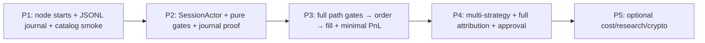
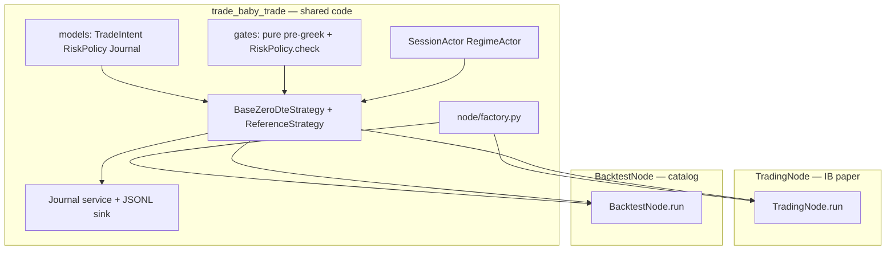

# 0DTE Implementation Plan

## Context

Design v2 in [`docs/design/`](docs/design/) is complete. The repo has **no application code** yet — only [`pyproject.toml`](pyproject.toml) (NautilusTrader 1.228+, Pydantic, Typer), CI smoke import, and design artifacts.

**Principle:** NautilusTrader orchestrates; we extend with Actors, Strategies, and thin policy objects. Do **not** build parallel ingestion, greek books, or batch pipelines.

**Phase 1 constraint:** Shared Strategy/Actor code must run on **both** `BacktestNode` and `TradingNode` from the start — using **stubs** in Phase 1, real behavior added incrementally in Phases 2–3.

---

## Delivery philosophy — vertical slices

Each phase must produce **observable, grep-able output** (journal lines), not only importable modules. Avoid long periods where code compiles but nothing can be audited.



**Correlation ID:** Every journal entry carries `ref_id` (= `TradeIntent.intent_id` once intents exist) plus `strategy_id`. Propagate through gate failures, order submit, and fills so traders and PnL checkers can trace one decision end-to-end.

---

## Architecture



### Gate architecture boundary (critical)

The greek gate **cannot** live entirely inside a pure evaluator — it requires NT's `GreeksCalculator`. Split responsibilities explicitly:

| Layer | Module | Pure? | Responsibility |
| --- | --- | --- | --- |
| Pre-greek gates | `gates/evaluator.py` → `evaluate_pre_greek()` | **Yes** | edge → liquidity → regime → session → operational |
| Greek snapshots | `BaseZeroDteStrategy` | No | `self.greeks.portfolio_greeks(spot_shock=..., vol_shock=...)` |
| Greek policy | `gates/evaluator.py` → `RiskPolicy.check()` | **Yes** | Limit math on `current_greeks` + `projected_greeks` snapshots |
| NT pre-trade | NT `RiskEngine` | No | notional, rate, qty/price — always on, not reimplemented |

**Strategy orchestration pattern:**

```
intent = build_intent(slice)
result = evaluate_pre_greek(intent, context)   # pure
if not result.passed: journal + return
projected = self.greeks.portfolio_greeks(...)  # NT
assessment = RiskPolicy.check(projected, ...)    # pure
if not assessment.passed: journal + return
submit_order_list(...)                         # NT RiskEngine → ExecutionEngine
```

Document this split in `docs/implementation/gate-boundary.md` (short ADR) before Phase 2 gate work.

### Operational gate checklist

Define in `config/schema.py` before implementing Phase 2 gates:

| Check | Source | Default |
| --- | --- | --- |
| Trading state active | NT node / config | Must be `ACTIVE` |
| Underlying quote freshness | Last `QuoteTick` ts vs now | &lt; 30s (configurable) |
| Chain snapshot freshness | Last `OptionChainSlice` ts vs now | &lt; WARM interval + buffer |
| Daily loss budget | Desk rule from `RiskPolicy` | Optional; block new entries if breached |
| Feed / adapter health | NT adapter status | Fail closed if disconnected |

Default: **no trade** until all checks pass. Each failure → `Journal.record(GateStage.OPERATIONAL, reason)`.

---

## Package layout

Introduce a standard `src/` layout and register the package in [`pyproject.toml`](pyproject.toml):

```
src/trade_baby_trade/
  __init__.py
  models/           # Pydantic value objects from data-model.puml
    enums.py
    trade_intent.py
    risk.py
    journal.py
    learning.py
    diversification.py
  journal/          # Journal service (cross-cutting audit)
    service.py      # in-memory + JSONL append sink
  gates/            # Pure gate logic (testable)
    evaluator.py    # evaluate_pre_greek(), RiskPolicy.check()
    context.py      # GateContext value object (session, regime, ops flags)
  actors/
    session.py      # SessionActor
    regime.py       # RegimeActor
    selector.py     # Phase 4 — SelectorActor
    ingestion.py    # Phase 5 — IngestionPlannerActor
  strategies/
    base.py         # NT Strategy subclass + lifecycle FSM
    reference.py    # ReferenceZeroDteStrategy
    skeleton.py     # Phase 1 — on_start/on_stop journal only
  approval/         # Phase 4
    classifier.py
    handlers.py
  learning/         # Phase 4
    module.py
  config/
    schema.py       # Pydantic config models
    loader.py       # YAML overlay merge + env
  node/
    factory.py      # build_trading_node / build_backtest_node
  cli/
    main.py         # typer: backtest, paper, journal
tests/
  unit/             # gates, models, risk policy, actors
  integration/      # BacktestNode smoke; TradingNode config smoke
  fixtures/
    catalog/        # minimal NT catalog slice (or README + download script)
configs/
  base.yaml                 # venue, logging, journal path
  risk/
    conservative.yaml       # policy maker owned
    default.yaml
  session/
    us_equity.yaml          # blackout T-30m
  strategies/
    reference.yaml          # strategy params, underlying SPY
  profiles/
    paper_spy.yaml          # merged profile for CLI default
docs/
  implementation/
    gate-boundary.md        # ADR: pure vs NT greek gate split
    learning-attribution.md # Phase 4 spike — theta/gamma/vega decomposition method
```

**Naming:** Python package `trade_baby_trade` (underscore); CLI entry `trade-baby-trade`.

### Config layering (persona-friendly)

`loader.py` merges overlays in order: `base.yaml` → `risk/*.yaml` → `session/*.yaml` → `strategies/*.yaml` → profile file.

| Persona | Edits | Example path |
| --- | --- | --- |
| Policy maker | Greek limits, shocks, daily loss | `configs/risk/conservative.yaml` |
| Strategy maker | Underlying, structure params, edge thresholds | `configs/strategies/reference.yaml` |
| Trader / operator | Profile selection, dry-run, journal path | `configs/profiles/paper_spy.yaml` |
| Coder | Factory wiring, new strategy class registration | `node/factory.py`, `config/schema.py` |

Journal payload includes `risk_policy_version` (hash or semver string) so policy changes are auditable in backtests.

---

## Phase 1 — Foundation, dual-node skeleton, first observable slice

**Goal:** Importable package, data model, **JSONL journal**, layered config, dual node factories with **stubs**, catalog smoke test, operator CLI basics. No trading logic yet — but nodes start/stop cleanly and journal proves lifecycle.

**Vertical slice proof:** Run `backtest` → JSONL contains `NODE_START`, `NODE_STOP`, `STRATEGY_START` from skeleton strategy.

### 1.1 Project scaffolding

- Add `[project.scripts]` and `[tool.hatch.build.targets.wheel]` / package discovery in [`pyproject.toml`](pyproject.toml).
- Add **dev dependencies now** (CI already runs `uv sync --group dev`): `pytest`, `ruff`.
- Pin NautilusTrader to a **specific patch** after first green build (e.g. `nautilus-trader==1.228.x`); document upgrade process.
- Validate **Python 3.14** wheel availability on macOS + CI Linux before Phase 1 closes; fall back to 3.13 only if blocked.
- Extend [`Makefile`](Makefile): `lint`, `test`, `backtest`, `paper`.
- Extend [`.github/workflows/ci.yml`](.github/workflows/ci.yml): ruff + pytest unit tests + BacktestNode integration smoke (no IB credentials).
- Document env vars in [`.env.example`](.env.example): `IB_HOST`, `IB_PORT`, `IB_CLIENT_ID` (names only; no values).

### 1.2 Catalog fixture spike (Phase 1 — not deferred)

BacktestNode smoke is on the critical path. Deliver one of:

- **Preferred:** Minimal committed catalog slice under `tests/fixtures/catalog/` (small, no secrets), sufficient for node start + skeleton strategy lifecycle.
- **Alternative:** `scripts/download_catalog_fixture.sh` + CI cache; document in `tests/fixtures/catalog/README.md`.

Integration test in Phase 1: `build_backtest_node(config, catalog_path) → run → exit cleanly`.

### 1.3 Custom data model ([`data-model.puml`](docs/design/data-model.puml))

Implement as immutable Pydantic v2 models:

| Type | Key fields | Notes |
| --- | --- | --- |
| `ActorKind`, `RegimeTag`, `GateStage` | enums | From data model; add `LIFECYCLE`, `FILL`, `PNL` journal stages for ops |
| `TradeIntent` | `intent_id`, `strategy_id`, `instrument_id` (str), gate fields, `projected_greeks`, `rationale` | Store NT `InstrumentId` as string; convert at Strategy boundary |
| `RiskPolicy` | limits + `spot_shock` / `vol_shock` + optional `version` | Value object only — no greek math |
| `RiskAssessment` | `passed`, `breached_rules`, greek snapshots | Output of `RiskPolicy.check()` |
| `DiversificationPolicy` | TopN caps | Phase 4 |
| `JournalEntry` | `entry_id`, `ts`, `stage`, `ref_id`, `strategy_id`, `level`, `payload` | Cross-cutting audit |
| `LearningRecord` | PnL attribution fields | Phase 4 full attribution |

**Explicitly do not implement:** `MarketSnapshot`, `GreekBook`, `OptionsChainSnapshot`, `IngestionService`, `Pipeline`.

### 1.4 Journal (durable from day one)

- `Journal.record(stage, ref_id, payload, strategy_id=...)` → append-only in-memory store **and** JSONL file sink (config: `journal.path`, default `runs/<timestamp>.jsonl`).
- Structured fields on every line: `ts`, `stage`, `ref_id`, `strategy_id`, `level`, `payload`.
- Phase 1 records: node lifecycle, skeleton strategy start/stop.
- Phases 2–3 add: gate pass/fail, state transitions, orders, fills, minimal PnL.

Optional Phase 4 refactor: extract `JournalActor` on MessageBus when SelectorActor adds multi-strategy fan-in. Start with injected service.

### 1.5 Config

- Layered YAML schema (see layout above): venue (IB), underlying, subscription profile ([`ingestion-tiers.md`](docs/design/ingestion-tiers.md) defaults), `RiskPolicy`, session blackout (T-30m), `dry_run`, `journal.path`.
- `loader.py`: merge overlays, overlay env vars, validate with Pydantic.

### 1.6 Node factory (dual-node, stubs)

[`node/factory.py`](src/trade_baby_trade/node/factory.py) exposes:

- `build_backtest_node(config, catalog_path) -> BacktestNode`
- `build_trading_node(config) -> TradingNode` — IB adapter config from env

**Phase 1 registers (stubs only):**

- `SkeletonZeroDteStrategy` — journals `on_start` / `on_stop`; no subscriptions or orders
- No `SessionActor` / `RegimeActor` yet (added Phase 2)
- Shared `Journal` instance injected into strategy

Factory contract is stable: Phases 2–3 swap stubs for real actors/strategies without changing CLI signatures.

**NT wiring (do not reimplement):** `DataEngine`, `GreeksCalculator`, `RiskEngine`, `ExecutionEngine`, `Portfolio`, `OrderEmulator`, `OptionChainManager` — configured via NT APIs only.

### 1.7 CLI skeleton + operator affordances

```bash
trade-baby-trade backtest --config configs/profiles/paper_spy.yaml --catalog tests/fixtures/catalog
trade-baby-trade paper   --config configs/profiles/paper_spy.yaml   # reads IB_* from env
trade-baby-trade backtest ... --dry-run   # evaluate only; no order submit (wired in Phase 3; flag accepted in Phase 1)
trade-baby-trade journal summary --path runs/latest.jsonl   # gate rejection counts, last events (Phase 1: lifecycle only; expands each phase)
```

Phase 1: `--dry-run` flag parsed and passed to config; skeleton ignores it. Phase 3: strategy respects it (journal intent, skip submit).

**Kill switch (stub in Phase 1, real in Phase 3):** Document `trade-baby-trade flatten --config ...` as future emergency flatten-all; Phase 1 CLI prints "not yet implemented" or no-ops with journal entry.

---

## Phase 2 — Actors + pure gate pipeline

**Goal:** Cross-cutting context on MessageBus; **unit-tested pure gates**; SessionActor blackout provable via journal in backtest.

**Vertical slice proof:** Backtest run → JSONL shows `SESSION` gate rejection during T-30m blackout window (or simulated clock).

### 2.0 Implementation ADR

Write `docs/implementation/gate-boundary.md` before coding gates (see Gate architecture boundary above).

### 2.1 SessionActor ([`class-diagram.puml`](docs/design/class-diagram.puml))

NT `Actor` subclass publishing custom data (NT `DataType` wrapper for session phase):

- `blackout_windows`, `minutes_to_expiry()`, `session_phase()`, `allows_entry()`, `flatten_signal()`
- Default: block new entries T-30m to close ([`state-diagram.puml`](docs/design/state-diagram.puml))
- Strategies subscribe via MessageBus / `subscribe_data`
- Register in node factory (replaces no-op for session context)

### 2.2 RegimeActor

Rule-based tags: `CHOP`, `TREND`, `PIN_RISK`, `UNKNOWN` — simple rules on underlying move/vol (configurable thresholds); no ML.

Register in node factory alongside SessionActor.

### 2.3 Pure gate evaluator ([`gates/evaluator.py`](src/trade_baby_trade/gates/evaluator.py))

**`evaluate_pre_greek(intent, context) -> GateResult`** — pure pipeline:

```
edge → liquidity → regime → session → operational
```

- `GateContext` carries: `regime_tag`, `session_allows_entry`, operational freshness flags, `risk_policy_version`.
- Each failure → caller journals `GateStage.*` with `breached_rules` and `ref_id=intent.intent_id`.
- Default: **no trade** until all pass.

**`RiskPolicy.check(current_greeks, projected_greeks) -> RiskAssessment`** — pure; no NT calls.

Unit tests: each pre-greek gate in isolation; `RiskPolicy.check` with fixture greek dicts; operational checklist cases.

**Not in evaluator:** `portfolio_greeks()` — Strategy calls NT, then passes snapshots to `RiskPolicy.check`.

### 2.4 Wire gates into SkeletonZeroDteStrategy (optional intermediate)

Before full reference strategy, extend skeleton or add `GatedSkeletonStrategy` that builds a dummy `TradeIntent` on timer/chain event and runs `evaluate_pre_greek` only — journals pass/fail without orders. Proves actor → gate → journal path.

### 2.5 CLI journal summary (Phase 2)

`journal summary` reports: counts by `GateStage`, last N entries, strategies active. Answers "why no trades?" for traders and policy makers.

---

## Phase 3 — Base Strategy + reference 0DTE strategy + minimal PnL

**Goal:** End-to-end flow from [`sequence-diagram.puml`](docs/design/sequence-diagram.puml) on both nodes: gates → greek check → order → fill.

**Vertical slice proof:** Backtest JSONL trail: `EDGE`…`GREEK` pass → `ORDER_SUBMIT` → `FILL` → `PNL` (realized from NT Portfolio).

### 3.1 BaseZeroDteStrategy ([`strategies/base.py`](src/trade_baby_trade/strategies/base.py))

NT `Strategy` subclass implementing per-strategy FSM ([`state-diagram.puml`](docs/design/state-diagram.puml)):

| State | Transitions |
| --- | --- |
| `Flat` | → `Evaluating` on chain/tick |
| `Evaluating` | → `Flat` (gate fail) or → `PendingEntry` (submit) |
| `PendingEntry` | → `Flat` (reject) or → `InPosition` (fill) |
| `InPosition` | → `Exiting` (TP/SL/hedge/time) or → `Flat` (session flatten) |
| `Exiting` | → `Flat` |

Hooks for subclasses: `build_intent(slice) -> TradeIntent | None`, `select_structure(slice) -> InstrumentId`.

Handlers: `on_start`, `on_option_chain`, `on_quote_tick`, `on_option_greeks`, `on_order_filled` — journal every transition with `intent_id`.

**Gate orchestration in base class:**

1. `evaluate_pre_greek(intent, context)`
2. `projected = self.greeks.portfolio_greeks(spot_shock=..., vol_shock=...)`
3. `RiskPolicy.check(current, projected)`
4. If `--dry-run` or `config.dry_run`: journal intent + stop before submit

Replace `SkeletonZeroDteStrategy` in factory with `ReferenceZeroDteStrategy` (or register via config-driven strategy id).

### 3.2 Config-driven strategy selection

`config/strategies/*.yaml` includes `strategy_class` (e.g. `reference`) and params. Factory maps id → class. New strategies add a class + YAML block without factory signature changes.

### 3.3 Subscriptions ([`ingestion-tiers.md`](docs/design/ingestion-tiers.md))

In `on_start`, apply default 0DTE equity profile:

| Concern | NT call | Tier |
| --- | --- | --- |
| Underlying | `subscribe_quote_ticks(underlying)` | HOT |
| Signal chain | `subscribe_option_chain(..., snapshot_interval_ms=60_000)` | WARM |
| Open legs | `subscribe_option_greeks` per leg when in position | HOT |

BacktestNode: same subscribe calls; data from catalog. TradingNode: IB instrument provider + `build_options_chain` at start.

### 3.4 ReferenceZeroDteStrategy

Minimal alpha for plumbing validation (not production edge):

- Select ATM ± N vertical spread from `OptionChainSlice`
- Populate `TradeIntent` with edge/liquidity scores from slice quotes
- Build `OrderList` for `OptionSpread` / IB BAG `InstrumentId`
- Submit via `submit_order_list` → NT `RiskEngine` → `ExecutionEngine` (skipped when `dry_run`)

### 3.5 Post-entry management

In `InPosition`:

- Delta band breach → hedge order via underlying/perp (config)
- TP/SL via `order_factory.bracket()` or `OrderEmulator`
- `SessionActor.flatten_signal` → flatten `OrderList`
- Journal all actions

Implement `flatten` CLI command: cancel open orders + submit flatten `OrderList` for in-position strategies.

### 3.6 Minimal fill PnL (before full LearningModule)

On `on_order_filled`:

- Journal `GateStage.FILL` (or dedicated `FILL` stage) with order id, instrument, qty, price
- Journal `PNL` with **realized PnL from NT `Portfolio`** for the strategy/instrument
- Include `edge_predicted_bps` from intent in payload for later attribution comparison

Full theta/gamma/vega decomposition deferred to Phase 4 `LearningModule`.

### 3.7 Gate rejection report (backtest helper)

CLI or test helper: `journal report --path runs/foo.jsonl` → table of gate failures by stage and `breached_rules`. Policy makers use this to tune `configs/risk/*.yaml`.

### 3.8 Integration tests

- **Backtest:** `ReferenceZeroDteStrategy` against catalog fixture; assert journal trail through gates → order → fill → PnL; state transitions.
- **TradingNode smoke:** build node with `--dry-run`; actors register; subscriptions fire; **no live orders in CI**.

Manual: `trade-baby-trade paper` against IB paper account after CI green.

---

## Phase 4 — Multi-strategy, approval, full learning attribution

Introduce when design says "N > 1" or fills accumulate — after Phase 3 path is stable.

**Do not enable SelectorActor in config until Phase 4** — Phase 3 assumes single strategy, full capital.

### 4.0 Learning attribution design spike

Write `docs/implementation/learning-attribution.md` before coding `LearningModule`: document approximation method for theta/gamma/vega PnL decomposition on 0DTE (rule-based, no ML). Review against `LearningRecord` fields in data model.

### 4.1 SelectorActor + DiversificationPolicy

- MessageBus join barrier: collect `TradeIntent`s from N strategies
- Apply TopN, `max_per_instrument`, `max_per_strategy`, deterministic sort
- Publish approved intents back to strategies or central submit path

### 4.2 ActorClassifier + approval handlers

- `classify(intent) -> HUMAN | AUTOMATION` by notional/risk thresholds
- **`HumanApprovalHandler` before automation path** — stub/CLI prompt initially; automation only after human path proven
- `AutomationHandler` → ExecutionEngine

### 4.3 LearningModule (full attribution)

- Subscribe to NT `OrderFilled` events
- Attribute theta/gamma/vega/slippage → `LearningRecord` per design spike
- Compare `edge_predicted_bps` vs `edge_realized_bps`
- Write through Journal; rule-based `calibrate()` hook (no ML)

### 4.4 Optional: JournalActor refactor

When SelectorActor fan-in complicates injected journal calls, refactor to `JournalActor` subscribing on MessageBus. Keep JSONL sink behavior identical.

---

## Phase 5 — Optional / deferred

| Component | Trigger | Notes |
| --- | --- | --- |
| `IngestionPlannerActor` | IB API cost measured | Emits `SubscriptionSpec` plan only; no fetch logic |
| Offline ProcessPool research | Factor/walk-forward need | [`concurrency-activity.puml`](docs/design/concurrency-activity.puml) — never on order path |
| Crypto venues (Deribit/OKX/Bybit) | After IB path proven | Venue-streamed greeks; shorter WARM interval |
| Derive adapter | NT adapter stable | Explicitly out of scope per design |

---

## Risk architecture (implementation contract)

Layer enforcement exactly as [`README.md`](docs/design/README.md):

1. **Strategy pre-submit (split):** `evaluate_pre_greek()` → NT `portfolio_greeks()` → `RiskPolicy.check()` → `RiskAssessment`
2. **NT RiskEngine:** always on — notional, rate, qty/price (configure via NT, not custom reimplementation)
3. **Post-entry:** continuous handlers in Strategy — not a batch `PositionManager`

---

## Persona deliverables by phase

| Persona | Phase 1 | Phase 2 | Phase 3 | Phase 4 |
| --- | --- | --- | --- | --- |
| **Coder** | Package, factory stubs, catalog fixture, ADR placeholder | Gate boundary ADR, pure tests | FSM, reference strategy, integration tests | Selector, LearningModule |
| **Trader** | `backtest`/`paper` start/stop; JSONL audit | `journal summary`; blackout visible in journal | `--dry-run`, `flatten`, paper manual | Human approval path |
| **Strategy maker** | Skeleton strategy hook points | Gated skeleton proof | `build_intent` / `select_structure` in reference; config-driven strategy id | Multi-strategy configs |
| **Policy maker** | Layered `configs/risk/*.yaml` | Gate rejection in journal | `journal report` by breached rule | Policy version in attribution |
| **PnL checker** | JSONL export | — | Fill + realized PnL journal lines | Full `LearningRecord` attribution |

---

## Testing strategy

| Layer | What | When |
| --- | --- | --- |
| Unit | `evaluate_pre_greek`, `RiskPolicy.check`, models, SessionActor blackout, operational checklist | Phase 2+ |
| Integration | `BacktestNode` catalog smoke (node lifecycle) | **Phase 1** |
| Integration | Full gate → order → fill journal trail | Phase 3 |
| Smoke | `TradingNode` builds, `--dry-run`, no credential-dependent orders | Phase 1–3 |
| Manual | `trade-baby-trade paper` against IB paper | After Phase 3 |

Per [`.cursor/rules/agent.mdc`](.cursor/rules/agent.mdc): add tests when adding behavior, not upfront scaffolding tests.

---

## Dependencies

| Group | Packages | When |
| --- | --- | --- |
| runtime | `nautilus-trader` (pin patch after first green), `pydantic`, `pyyaml`, `typer` | Phase 1 |
| dev | `pytest`, `ruff` | **Phase 1** (CI already expects dev group) |

Catalog fixture: committed slice or documented download — **Phase 1**, not Phase 3.

---

## Success criteria by phase

| Phase | Done when |
| --- | --- |
| **1** | `backtest` runs against catalog fixture; JSONL contains node + skeleton lifecycle; `paper` builds node; ruff + pytest CI green; dev deps populated |
| **2** | Pure gates unit-tested; SessionActor blackout produces journal rejection in backtest; `journal summary` shows gate counts |
| **3** | Backtest JSONL: gates → order → fill → realized PnL; `--dry-run` journals intent without submit; `paper` uses same strategy class; `flatten` stub or implemented |
| **4** | Two strategies + SelectorActor TopN; `LearningRecord` on fills; human approval before automation; optional JournalActor |
| **5** | Optional components behind feature flags |

---

## Key files to create first (Phase 1 order)

1. [`pyproject.toml`](pyproject.toml) — package config + dev deps
2. [`tests/fixtures/catalog/`](tests/fixtures/catalog/) — minimal catalog or download README
3. [`src/trade_baby_trade/models/`](src/trade_baby_trade/models/) — data model
4. [`src/trade_baby_trade/journal/service.py`](src/trade_baby_trade/journal/service.py) — in-memory + JSONL
5. [`src/trade_baby_trade/config/loader.py`](src/trade_baby_trade/config/loader.py) — layered YAML
6. [`configs/profiles/paper_spy.yaml`](configs/profiles/paper_spy.yaml) — default profile
7. [`src/trade_baby_trade/node/factory.py`](src/trade_baby_trade/node/factory.py) — dual-node + skeleton strategy
8. [`src/trade_baby_trade/cli/main.py`](src/trade_baby_trade/cli/main.py) — backtest, paper, journal summary
9. [`docs/implementation/gate-boundary.md`](docs/implementation/gate-boundary.md) — stub ADR before Phase 2 gate work

---

## Phase 1 handoff (completed 2026-06-21)

**Vertical slice proof:** `make backtest` → `runs/latest.jsonl` contains `NODE_START`, `NODE_STOP`, `STRATEGY_START`, `STRATEGY_STOP`.

### Delivered

| Area | Path | Notes |
| --- | --- | --- |
| Package | `src/trade_baby_trade/` | hatch wheel, CLI entry `trade-baby-trade` |
| Models | `models/` | Pydantic v2; `GateStage.LIFECYCLE/FILL/PNL` added |
| Journal | `journal/service.py` | in-memory + JSONL append |
| Config | `config/loader.py`, `configs/` | layered YAML merge + env overlay |
| Factory | `node/factory.py` | `build_backtest_node`, `build_trading_node`, `run_backtest` |
| Strategy | `strategies/skeleton.py` | lifecycle journal only |
| CLI | `cli/main.py` | `backtest`, `paper`, `journal summary`, `flatten` stub |
| Catalog | `tests/fixtures/catalog/` | SPY.NYSE + 100 ticks; regen via `scripts/build_catalog_fixture.py` |
| ADR stub | `docs/implementation/gate-boundary.md` | expand before Phase 2 |
| CI | `.github/workflows/ci.yml` | ruff + unit + integration smoke |
| NT pin | `pyproject.toml` | `nautilus-trader[ib]==1.228.0` |

### Known constraints for Phase 2

1. **Skeleton strategy opens its own `Journal`** via `journal_path` config (ImportableStrategyConfig cannot inject Python objects). Factory wraps `run_backtest` with separate journal for `NODE_*` events — both write to the same JSONL path.
2. **TradingNode in pytest** requires an explicit asyncio event loop (`asyncio.new_event_loop()`); Python 3.14 + NT do not auto-create one in test context.
3. **IB adapter** attaches only when `IB_HOST` env is set and `nautilus-ibapi` is installed; CI uses `--dry-run` / config `dry_run: true` for paper smoke.
4. **`RiskPolicy.check()`** lives on the model for now; Phase 2 should move call site to `gates/evaluator.py` per ADR.
5. **No `gates/` or `actors/` modules yet** — Phase 2 adds them without changing factory CLI signatures.

### Phase 2 start checklist

1. Read and expand `docs/implementation/gate-boundary.md` (operational gate fields in `config/schema.py`).
2. Implement `gates/context.py` (`GateContext`) and `gates/evaluator.py` (`evaluate_pre_greek`, wire `RiskPolicy.check`).
3. Implement `actors/session.py` (blackout T-30m) and `actors/regime.py` (rule-based tags).
4. Register actors in `node/factory.py` for both BacktestNode and TradingNode.
5. Unit-test each pre-greek gate stage + `RiskPolicy.check` with fixture greek dicts.
6. Extend skeleton or add `GatedSkeletonStrategy` to build dummy `TradeIntent` and journal gate pass/fail.
7. Expand `journal summary` to report counts by `GateStage` including gate rejections.
8. **Vertical slice proof for Phase 2:** backtest JSONL shows `SESSION` gate rejection during T-30m blackout window.

---

## Phase 2 handoff (completed 2026-06-21)

**Vertical slice proof:** backtest with `session.market_close_utc: "14:45"` (catalog ticks at 14:30–14:35 UTC) → JSONL contains `SESSION` / `GATE_REJECT` / `session_blackout`.

### Delivered

| Area | Path | Notes |
| --- | --- | --- |
| ADR | `docs/implementation/gate-boundary.md` | Accepted; operational checklist + actor msgbus pattern |
| Gates | `gates/context.py`, `gates/evaluator.py` | Pure `evaluate_pre_greek`, `check_risk_policy` wrapper |
| Config | `config/schema.py` | `RegimeConfig`, `GateThresholdsConfig`, `OperationalConfig` |
| SessionActor | `actors/session.py` | Blackout T-30m; pure helpers unit-tested |
| RegimeActor | `actors/regime.py` | Rule-based CHOP/TREND/PIN_RISK/UNKNOWN |
| Actor transport | `actors/data_types.py` | MessageBus topics + dataclass snapshots |
| Strategy | `strategies/gated_skeleton.py` | Dummy intent → pre-greek gates → journal |
| Factory | `node/factory.py` | Actors + config-driven `gated_skeleton` strategy |
| CLI | `cli/main.py` | `journal summary` gate rejection counts |
| Tests | `tests/unit/test_gates.py`, `test_actors.py`, `integration/test_gate_backtest.py` | 31 tests green |

### Known constraints for Phase 3

1. **Actor context via MessageBus topics** — not NT `customdataclass`/`publish_data` (inner payload must be `Data` subclass). Topics: `data.session.phase`, `data.regime.tag`.
2. **SessionActor publishes on quote tick** — strategies must subscribe in `on_start` before first tick; fail-closed until first `SessionPhaseSnapshot` received.
3. **`GatedSkeletonStrategy` evaluates once** on first quote tick after session snapshot — Phase 3 `BaseZeroDteStrategy` evaluates on every `on_option_chain` / tick per FSM.
4. **`require_chain_snapshot: false`** in `paper_spy.yaml` for skeleton — reference strategy must set real chain freshness from `OptionChainSlice` ts.
5. **Dual journal paths unchanged** — factory `NODE_*` journal + strategy journal both append to same JSONL path.

### Phase 3 start checklist

1. Implement `strategies/base.py` — per-strategy FSM (`Flat` → `Evaluating` → `PendingEntry` → `InPosition` → `Exiting`).
2. Gate orchestration in base: `evaluate_pre_greek` → NT `portfolio_greeks()` → `check_risk_policy` → submit (or journal + stop on `--dry-run`).
3. Implement `ReferenceZeroDteStrategy` — `subscribe_quote_ticks`, `subscribe_option_chain`, build `TradeIntent`, `OrderList` submit.
4. Config-driven strategy selection: `strategy_class: reference` maps in factory `_STRATEGY_PATHS`.
5. On `on_order_filled`: journal `FILL` + realized PnL from NT `Portfolio`.
6. Integration test: full journal trail gates → order → fill → PnL against catalog fixture.
7. Implement or stub `flatten` CLI command for session-driven flatten.
