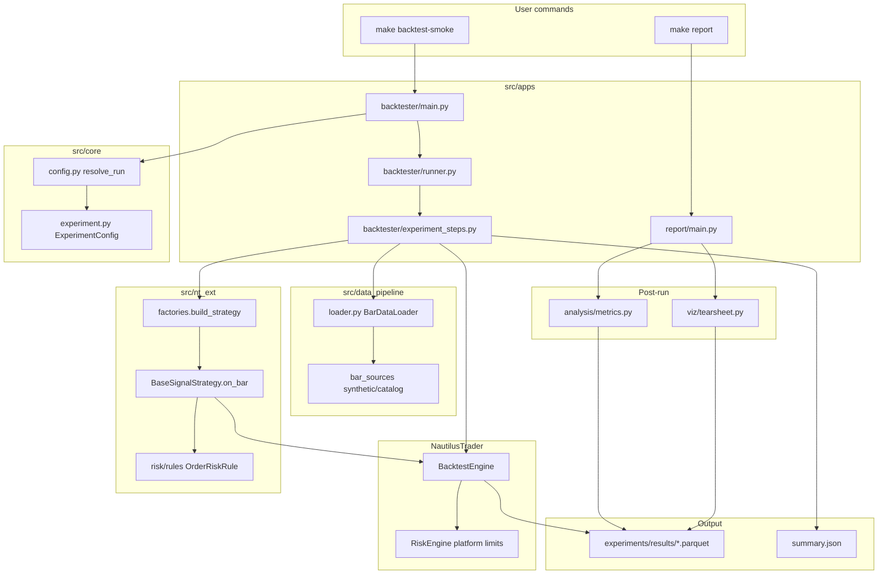

# Codebase Mastery Curriculum

## Architecture map (Session 0 — start here)

### What NautilusTrader (NT) provides vs. what this repo adds

**NautilusTrader** is an open-source event-driven trading engine (Rust core + Python bindings). It owns:

| NT subsystem | What it does | Where this repo touches it |
|---|---|---|
| **BacktestEngine** / **TradingNode** | Simulates or runs live market time, dispatches events | [`src/apps/backtester/experiment_steps.py`](src/apps/backtester/experiment_steps.py) builds `BacktestEngine`; [`src/apps/live/node.py`](src/apps/live/node.py) builds `TradingNode` |
| **Order Management System (OMS)** | Tracks orders, fills, positions | Repo reads NT reports after `engine.run()` — never reimplements OMS |
| **RiskEngine** (platform-level) | Hard limits on notional per order | [`src/nt_ext/risk/engine.py`](src/nt_ext/risk/engine.py) maps `RiskSettings.max_notional_per_order` → `RiskEngineConfig` |
| **Strategy lifecycle** | `on_start`, `on_bar`, order submission APIs | [`src/nt_ext/strategies/base.py`](src/nt_ext/strategies/base.py) subclasses NT's `Strategy` |
| **Instrument / Bar / Venue models** | Canonical market data types | Data pipeline emits NT `Bar` + `Instrument` objects; strategies consume them |

**This repo (`trade_baby_trade`)** is the extension layer — everything NT does *not* decide for you:

| Package | Single job | Depends on | Depended on by |
|---|---|---|---|
| [`src/core/`](src/core/) | Config loading, experiment schemas, suite orchestration, secrets resolution | YAML on disk, env vars | All other packages |
| [`src/data_pipeline/`](src/data_pipeline/) | Ingest, normalize, catalog, load bars into NT types | `core` | `apps/backtester`, `apps/live` |
| [`src/nt_ext/`](src/nt_ext/) | Strategies, signal engines, strategy-level risk rules, factories | `core`, `models.inference` (protocol only) | `apps/*` via factories |
| [`src/models/`](src/models/) | JAX/RL training, `SignalModel` protocol, artifact loading | numpy; JAX only inside concrete impls | `nt_ext/factories`, `apps/train` |
| [`src/analysis/`](src/analysis/) | Pure metrics on persisted Parquet results | pandas, saved run files | `apps/backtester`, `apps/report`, `viz` |
| [`src/viz/`](src/viz/) | Plotly tearsheet rendering | `analysis` | `apps/report` |
| [`src/apps/`](src/apps/) | CLI entrypoints only — wire config → data → engine → results | all above | `make *` targets, `tbt-*` CLIs |
| [`config/`](config/) | Declarative experiment and environment definitions | — | `core/config.py` loaders |
| [`tests/`](tests/) | Unit + integration guardrails | all packages | CI, `make test` |

**Design standard:** [`.cursor/rules/design-principles.mdc`](.cursor/rules/design-principles.mdc) — SOLID at extension boundaries; registries (`STRATEGY_REGISTRY`, `MODEL_LOADERS`, `VENUE_CLIENT_FACTORIES`) instead of `if key ==` dispatch; protocols (`SignalModel`, `OrderRiskRule`) instead of concrete imports across layers.

### End-to-end flow: `make backtest-smoke`

Command: `uv run tbt-backtest run --config config/strategies/ema_cross_demo.yaml --env backtest`

1. **CLI** — [`src/apps/backtester/main.py`](src/apps/backtester/main.py): Typer parses args; builds a synthetic `RunProfile` via `profile_from_cli`.
2. **Config resolution** — [`src/core/config.py`](src/core/config.py): deep-merges `config/base.yaml` + `config/backtest.yaml` → `AppConfig`; loads experiment YAML → `ExperimentConfig` ([`src/core/experiment.py`](src/core/experiment.py)).
3. **Orchestration** — [`src/apps/backtester/runner.py`](src/apps/backtester/runner.py) `run_experiment()`:
   - Optionally loads a `SignalModel` from `artifacts/` if `model_artifact` is set.
   - Builds NT `BacktestEngine` + SIM venue.
   - Loads bars via `BarDataLoader`.
   - Adds strategy, runs engine, persists results.
4. **Engine setup** — [`experiment_steps.build_backtest_engine`](src/apps/backtester/experiment_steps.py): `BacktestEngineConfig` with NT `RiskEngineConfig` from project settings; adds venue with starting balance.
5. **Data** — [`src/data_pipeline/loader.py`](src/data_pipeline/loader.py): for `data.source: synthetic`, `SyntheticBarSource` generates deterministic NT `Bar` objects (seed 42, 2000 bars); resolves `EUR/USD.SIM` instrument.
6. **Strategy wiring** — [`src/nt_ext/factories.py`](src/nt_ext/factories.py): `STRATEGY_REGISTRY["ema_cross"]` → `EMACross` with `MaxNotionalPerOrderRule`, `MaxOpenPositionsRule`, `DrawdownTracker`.
7. **Simulation** — NT replays bars; [`BaseSignalStrategy.on_bar`](src/nt_ext/strategies/base.py) → `EmaCrossSignalEngine` → risk-checked order submission → NT OMS fills.
8. **Persistence** — [`src/apps/backtester/results.py`](src/apps/backtester/results.py): NT reports → Parquet (`fills`, `positions`, `account`) + `summary.json` under `experiments/results/<run_id>/`.
9. **Metrics enrichment** — [`src/analysis/metrics.py`](src/analysis/metrics.py): Sharpe, max drawdown, hit rate computed from equity curve and trade PnLs; written back to `summary.json`.
10. **Report** (`make report`) — [`src/apps/report/main.py`](src/apps/report/main.py): finds latest run, re-computes metrics, [`src/viz/tearsheet.py`](src/viz/tearsheet.py) renders `tearsheet.html`.

**Key insight:** Backtest and live share the same factory path (`build_strategy`) — the only difference is which NT runtime hosts the strategy (`BacktestEngine` vs `TradingNode`).

---

## Teaching format (every session)

For each file (or tight file group):

1. One-sentence responsibility
2. Top-to-bottom walkthrough in 5–15 line chunks: what, why, first-principles for new concepts
3. SOLID / design-pattern flags against [`design-principles.mdc`](.cursor/rules/design-principles.mdc)
4. Novice misread warnings
5. **Pause** — 3–5 quiz questions; wait for answers; correct with line citations
6. If quiz reveals gaps → re-explain smaller chunk before advancing

At each **module boundary**, run the relevant command and interpret output together:

| After module | Command |
|---|---|
| `core/` + smoke config | `make setup` then `make backtest-smoke` |
| `data_pipeline/` | Re-run smoke; inspect bar count / data_range in summary |
| `nt_ext/` | Change a param in YAML; observe fill count change |
| `analysis/` + `viz/` | `make report`; open `tearsheet.html` |
| Full pass | `make lint test` |
| Suites | `make backtest-suite` |

**Capstone (final session):** You explain the full path unprompted — every module from `make backtest-smoke` to tearsheet render.

---

## Module order and file queue

### Module 1: `src/core/` (foundation — nothing else loads without this)

Why first: every CLI, loader, and factory call starts with config resolution.

| Order | File | Why this order |
|---|---|---|
| 1 | [`src/core/config.py`](src/core/config.py) | App-level settings, env merge, `resolve_run` |
| 2 | [`src/core/secrets.py`](src/core/secrets.py) | Env-var resolution for venue credentials |
| 3 | [`src/core/experiment.py`](src/core/experiment.py) | Experiment YAML schema (`StrategySpec`, `DataSpec`) |
| 4 | [`src/core/run_profile.py`](src/core/run_profile.py) | Suite profiles, parallelism config |
| 5 | [`src/core/orchestrator.py`](src/core/orchestrator.py) | Parallel suite dispatch |
| 6 | [`src/core/active_strategy.py`](src/core/active_strategy.py) | Watcher state for switcher meta-strategy |

**Hands-on:** `make setup`, `make backtest-smoke` — trace printed metrics back to `summary.json` fields.

---

### Module 2: `src/data_pipeline/` (feeds the engine)

Why second: backtest cannot run until bars and instruments exist as NT objects.

| Order | File(s) |
|---|---|
| 1 | [`schemas.py`](src/data_pipeline/schemas.py) — normalized column contract |
| 2 | [`catalog.py`](src/data_pipeline/catalog.py) + [`watermarks.py`](src/data_pipeline/watermarks.py) |
| 3 | [`instrument_resolver.py`](src/data_pipeline/instrument_resolver.py) |
| 4 | [`bar_sources.py`](src/data_pipeline/bar_sources.py) — synthetic vs catalog |
| 5 | [`data_window.py`](src/data_pipeline/data_window.py) |
| 6 | [`bar_cache.py`](src/data_pipeline/bar_cache.py) + [`loader.py`](src/data_pipeline/loader.py) |
| 7 | [`ingestion/synthetic.py`](src/data_pipeline/ingestion/synthetic.py), [`ingestion/databento.py`](src/data_pipeline/ingestion/databento.py) (ingestion only — not on smoke path) |

**Hands-on:** Re-run smoke; read `data_range` in `summary.json`; optionally switch `data.source` to `catalog` once catalog exists.

---

### Module 3: `src/nt_ext/` (trading logic on NT)

Why third: strategies and risk consume bars and emit orders into NT.

| Order | File(s) |
|---|---|
| 1 | [`strategies/signals.py`](src/nt_ext/strategies/signals.py) — `SignalIntent`, `SignalEngine` protocol |
| 2 | [`strategies/base.py`](src/nt_ext/strategies/base.py) — lifecycle, risk-checked submission |
| 3 | [`strategies/multi_asset/ema_cross.py`](src/nt_ext/strategies/multi_asset/ema_cross.py) — reference strategy |
| 4 | [`risk/rules.py`](src/nt_ext/risk/rules.py) — `OrderRiskRule`, `OrderContext` DTO |
| 5 | [`risk/engine.py`](src/nt_ext/risk/engine.py) — NT RiskEngine bridge |
| 6 | [`factories.py`](src/nt_ext/factories.py) — registries, backtest/live parity |
| 7 | [`strategies/multi_asset/switcher.py`](src/nt_ext/strategies/multi_asset/switcher.py) — meta-strategy (suite path) |
| 8 | [`strategies/options/`](src/nt_ext/strategies/options/) — options selection (secondary) |

**Hands-on:** Edit `fast_period` in [`config/strategies/ema_cross_demo.yaml`](config/strategies/ema_cross_demo.yaml); re-run smoke; compare `n_fills`.

---

### Module 4: `src/models/` (optional ML/RL path)

Why fourth: strategies depend on `SignalModel` protocol, not JAX; concrete models plug in via factory.

| Order | File(s) |
|---|---|
| 1 | [`inference.py`](src/models/inference.py) — `SignalModel` Protocol |
| 2 | [`loader.py`](src/models/loader.py) — `MODEL_LOADERS` registry |
| 3 | [`features/basic.py`](src/models/features/basic.py) |
| 4 | [`jax_signal.py`](src/models/jax_signal.py) + [`architectures/mlp.py`](src/models/architectures/mlp.py) |
| 5 | [`training/train_mlp.py`](src/apps/train/main.py) + [`promotion.py`](src/models/promotion.py) |
| 6 | [`rl/envs/market_env.py`](src/models/rl/envs/market_env.py) — Gymnasium env on backtest data |

**Note:** Requires `uv sync --group models`. EMA smoke path works with `signal_model=None`.

---

### Module 5: `src/analysis/` + `src/viz/`

Why here: pure post-run; no engine imports.

| Order | File(s) |
|---|---|
| 1 | [`analysis/runs.py`](src/analysis/runs.py) — load Parquet |
| 2 | [`analysis/metrics.py`](src/analysis/metrics.py) — Sharpe, drawdown, hit rate |
| 3 | [`analysis/compare.py`](src/analysis/compare.py) — suite ranking |
| 4 | [`viz/tearsheet.py`](src/viz/tearsheet.py) — Plotly HTML |

**Hands-on:** `make report` — map each tearsheet panel to source columns in `account.parquet` / `fills.parquet`.

---

### Module 6: `src/apps/` (orchestration — read last among src)

Why last: apps are thin glue; understanding them is easier once dependencies are known.

| Order | File(s) |
|---|---|
| 1 | [`backtester/experiment_steps.py`](src/apps/backtester/experiment_steps.py) |
| 2 | [`backtester/runner.py`](src/apps/backtester/runner.py) + [`backtester/results.py`](src/apps/backtester/results.py) |
| 3 | [`backtester/main.py`](src/apps/backtester/main.py) + [`backtester/watcher.py`](src/apps/backtester/watcher.py) |
| 4 | [`report/main.py`](src/apps/report/main.py) |
| 5 | [`live/node.py`](src/apps/live/node.py) + [`live/main.py`](src/apps/live/main.py) |
| 6 | [`train/main.py`](src/apps/train/main.py) |

**Hands-on:** `make backtest-suite`, `make lint test`.

---

### Module 7: `config/` + `tests/`

| Area | Files |
|---|---|
| Config layering | [`config/base.yaml`](config/base.yaml), [`config/backtest.yaml`](config/backtest.yaml), experiment YAMLs, [`config/suites/ema_eval.yaml`](config/suites/ema_eval.yaml) |
| Tests | Mirror structure under [`tests/`](tests/) — read tests for the module just studied |

---

## Glossary (introduced on first use in teaching)

- **NautilusTrader (NT)** — event-driven backtest/live engine
- **Venue** — exchange or broker simulator (e.g. `SIM` in smoke test)
- **Bar** — OHLCV candlestick for a time interval
- **Protocol** — Python structural typing interface (`SignalModel`)
- **Parquet** — columnar binary file format for fills/account data
- **Registry** — dict mapping string keys to builders (Open/Closed principle)
- **Tearsheet** — performance report chart (equity, drawdown, trade PnL)
- **JAX / Flax / Optax** — numerical computing, neural nets, optimizers (models group only)
- **Gymnasium** — RL environment API

---

## First session after plan approval

**Deliverable:** Architecture map (above) + begin **Module 1, File 1**: [`src/core/config.py`](src/core/config.py) — full line-by-line teaching with quiz.

No file advances until quiz answers are submitted and validated.
