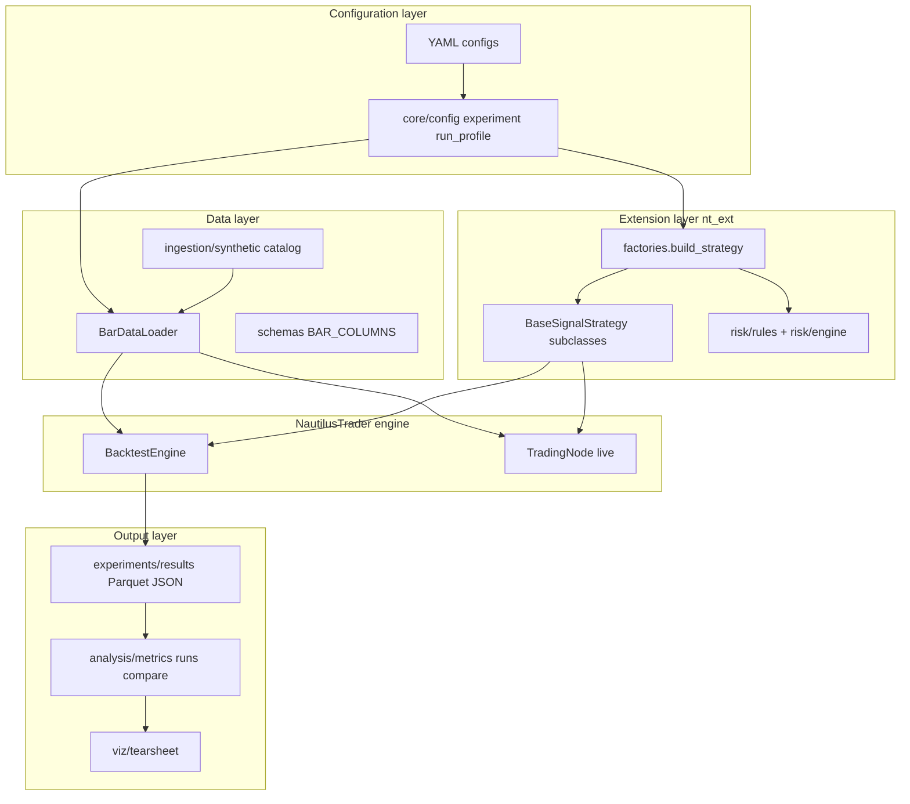
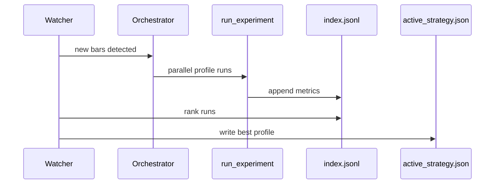

# How to Read and Master trade_baby_trade

## What this repo is (one sentence)

**NautilusTrader runs the engine; this repo owns everything around it** — configs, data, strategies, risk policy, models, backtest/live CLIs, and results.

You do not need to memorize ~89 files at once. There is a **spine** of ~15 files that explains 80% of behavior. Master the spine first, then expand in layers.

---

## The mental model



**Design principles to keep in mind while reading:**

| Principle | Where you see it |
|-----------|------------------|
| Config-driven, not hard-coded | All runs start from YAML → Pydantic models in [`src/core/`](src/core/) |
| Backtest/live parity | Same [`build_strategy()`](src/nt_ext/factories.py) used by backtester and live node |
| Extension, not fork | No NautilusTrader source edits; everything in [`src/nt_ext/`](src/nt_ext/) |
| Secrets never in repo | [`core/secrets.py`](src/core/secrets.py), env var names in YAML only |
| Deferred heavy imports | JAX/Plotly imported inside functions so core backtest works without optional deps |

---

## Phase 0: Prerequisites (before reading code)

**Run the smoke path once** so you have artifacts to inspect:

```bash
make setup
make backtest-smoke
make report
```

Then open the output under `experiments/results/<run_id>/`:
- `summary.json` — metrics + config snapshot
- `fills.parquet`, `positions.parquet`, `account.parquet` — what the engine produced

**External knowledge you will need alongside this repo:**

1. **NautilusTrader basics** — `Strategy`, `Bar`, `Instrument`, `BacktestEngine`, event loop (`on_start` → `on_bar` → `on_stop`). Read [NautilusTrader docs](https://nautilustrader.io/docs/) sections on Backtesting and Strategies.
2. **Python patterns used here** — Pydantic models, Typer CLI, Protocol types, deferred imports.
3. **Trading concepts** — OHLCV bars, EMA crossover, notional, drawdown, Sharpe ratio.

You cannot understand [`BaseSignalStrategy`](src/nt_ext/strategies/base.py) without knowing what NautilusTrader's `Strategy.on_bar()` means.

---

## Phase 1: The spine — trace one backtest line by line

**Goal:** Understand exactly what happens when you run `make backtest-smoke`.

**Read in this order** (each file answers "what happens next"):

| Step | File | What to understand |
|------|------|-------------------|
| 1 | [`config/strategies/ema_cross_demo.yaml`](config/strategies/ema_cross_demo.yaml) | The *contract* for a run: strategy key, params, data source, venue, risk |
| 2 | [`src/core/experiment.py`](src/core/experiment.py) | How YAML becomes `ExperimentConfig` / `StrategySpec` / `DataSpec` |
| 3 | [`src/core/config.py`](src/core/config.py) | How `base.yaml` + `backtest.yaml` merge into `AppConfig` |
| 4 | [`src/apps/backtester/main.py`](src/apps/backtester/main.py) | CLI: `profile_from_cli` → `resolve_run` → `run_experiment` |
| 5 | [`src/apps/backtester/runner.py`](src/apps/backtester/runner.py) | **The orchestration heart**: engine setup, load bars, add strategy, run, persist |
| 6 | [`src/data_pipeline/loader.py`](src/data_pipeline/loader.py) | Synthetic vs catalog paths, caching, instrument resolution |
| 7 | [`src/data_pipeline/ingestion/synthetic.py`](src/data_pipeline/ingestion/synthetic.py) | How deterministic bars are generated (seed=42) |
| 8 | [`src/nt_ext/factories.py`](src/nt_ext/factories.py) | `STRATEGY_REGISTRY`, wiring risk rules + drawdown tracker |
| 9 | [`src/nt_ext/strategies/multi_asset/ema_cross.py`](src/nt_ext/strategies/multi_asset/ema_cross.py) | The actual trading logic (~60 lines) |
| 10 | [`src/nt_ext/strategies/base.py`](src/nt_ext/strategies/base.py) | Lifecycle, risk gating, order helpers — **read carefully** |
| 11 | [`src/apps/backtester/results.py`](src/apps/backtester/results.py) | How fills/positions/account become Parquet + summary |
| 12 | [`tests/integration/test_smoke_backtest.py`](tests/integration/test_smoke_backtest.py) | What "correct" looks like (trades exist, deterministic) |

**Exercise:** Add a `typer.echo` or temporary log in `runner.py` after `engine.run()` and re-run smoke. Confirm you can see where fills are generated vs where metrics are computed (`summarize_performance` is called *after* initial write).

**Key call chain to memorize:**

```
tbt-backtest run
  → profile_from_cli / resolve_run
  → run_experiment
      → bar_loader.load_bars (synthetic)
      → build_strategy(exp.strategy)
      → engine.run()
      → write_run_results + summarize_performance
```

---

## Phase 2: Configuration and secrets (why runs are reproducible)

| File | Why it exists |
|------|---------------|
| [`config/base.yaml`](config/base.yaml) | Shared defaults: paths, logging, risk |
| [`config/backtest.yaml`](config/backtest.yaml) | Backtest-specific overlay (no live venues) |
| [`config/paper.yaml`](config/paper.yaml) / [`config/live.yaml`](config/live.yaml) | Binance venue refs via env var *names* |
| [`src/core/run_profile.py`](src/core/run_profile.py) | Suite profiles: one experiment YAML + env + path overrides |
| [`src/core/secrets.py`](src/core/secrets.py) | Runtime secret resolution; fails loudly if missing |
| [`.env.example`](.env.example) | Documents required vars |

**Exercise:** Change `fast_period: 10` → `15` in [`ema_cross_demo.yaml`](config/strategies/ema_cross_demo.yaml), re-run smoke, compare `n_fills` and `pnl` in two `summary.json` files. This connects config → strategy behavior → metrics.

**Exercise:** Read [`tests/unit/test_config.py`](tests/unit/test_config.py) and [`tests/unit/test_secrets.py`](tests/unit/test_secrets.py) — tests document edge cases (deep merge, literal secret rejection).

---

## Phase 3: Data pipeline (ingestion → catalog → loader)

| File | Purpose |
|------|---------|
| [`src/data_pipeline/schemas.py`](src/data_pipeline/schemas.py) | Canonical bar column contract — **all ingestion must conform** |
| [`src/data_pipeline/catalog.py`](src/data_pipeline/catalog.py) | Thin wrapper over NT `ParquetDataCatalog` |
| [`src/data_pipeline/watermarks.py`](src/data_pipeline/watermarks.py) | Tracks "last processed bar" for incremental backtests |
| [`src/data_pipeline/ingestion/databento.py`](src/data_pipeline/ingestion/databento.py) | Stub — real ingestion not wired yet |

**Why caching in `loader.py`?** Suite runs and the watcher re-load the same bar windows repeatedly; LRU memory + disk cache avoids regenerating/re-reading Parquet.

**Exercise:** Read [`tests/unit/test_data_pipeline.py`](tests/unit/test_data_pipeline.py) and [`tests/unit/test_bar_loader.py`](tests/unit/test_bar_loader.py). Run `uv run pytest tests/unit/test_bar_loader.py -v`.

---

## Phase 4: Strategies and risk (where trading decisions happen)

### Strategy layer

| File | What to learn |
|------|---------------|
| [`src/nt_ext/strategies/base.py`](src/nt_ext/strategies/base.py) | `on_bar` pipeline: halted? → drawdown? → indicators warm? → `on_signal_bar` |
| [`src/nt_ext/strategies/multi_asset/ema_cross.py`](src/nt_ext/strategies/multi_asset/ema_cross.py) | Indicator registration, entry/exit logic, optional model overlay |
| [`src/nt_ext/strategies/multi_asset/switcher.py`](src/nt_ext/strategies/multi_asset/switcher.py) | Meta-strategy: reads `data/state/active_strategy.json`, delegates to winner |
| [`src/nt_ext/strategies/options/selection.py`](src/nt_ext/strategies/options/selection.py) | Helper only — no full options strategy yet |

**Critical `base.py` behaviors to know cold:**

- `_check_drawdown()` — flattens and sets `_halted` on breach
- `_risk_approved()` — runs `OrderRiskRule.check()` before every order
- `submit_market_order()` — the only path subclasses should use for entries

### Risk layer (two layers — understand both)

1. **Project rules** ([`src/nt_ext/risk/rules.py`](src/nt_ext/risk/rules.py)) — pure Python, unit-testable, checked in strategy before submit
2. **NT RiskEngine** ([`src/nt_ext/risk/engine.py`](src/nt_ext/risk/engine.py)) — platform-level limits passed into `BacktestEngineConfig`

**Exercise:** Read [`tests/unit/test_risk_rules.py`](tests/unit/test_risk_rules.py). Temporarily set `max_notional_per_order: 1` in experiment YAML and confirm orders get rejected (check logs or zero fills).

---

## Phase 5: Suite evaluation and continuous backtesting

This is the "production ops" layer beyond single runs.

| File | Role |
|------|------|
| [`config/suites/ema_eval.yaml`](config/suites/ema_eval.yaml) | Defines parallel profiles (`ema_fast`, `ema_slow`) |
| [`src/core/orchestrator.py`](src/core/orchestrator.py) | Process-pool fan-out across profiles |
| [`src/analysis/compare.py`](src/analysis/compare.py) | Ranks runs from `index.jsonl` |
| [`src/core/active_strategy.py`](src/core/active_strategy.py) | Persists best profile to `data/state/active_strategy.json` |
| [`src/apps/backtester/watcher.py`](src/apps/backtester/watcher.py) | Daemon: poll catalog watermarks → re-run suite → update active strategy |



**Exercise:** Run `make backtest-suite`, inspect `experiments/results/index.jsonl`. Read [`tests/integration/test_suite_backtest.py`](tests/integration/test_suite_backtest.py).

---

## Phase 6: Models and ML (optional group, but core to the vision)

| File | Role |
|------|------|
| [`src/models/inference.py`](src/models/inference.py) | `SignalModel` protocol — **stable contract**, no JAX import |
| [`src/models/jax_signal.py`](src/models/jax_signal.py) | Loads artifact, serves predictions to strategies |
| [`src/models/features/basic.py`](src/models/features/basic.py) | Shared feature names/transforms |
| [`src/models/architectures/mlp.py`](src/models/architectures/mlp.py) | Pure JAX MLP |
| [`src/models/training/train_mlp.py`](src/models/training/train_mlp.py) | Offline training via `tbt-train mlp` |
| [`src/models/registry.py`](src/models/registry.py) | Serialize params to `artifacts/` |
| [`src/models/rl/envs/market_env.py`](src/models/rl/envs/market_env.py) | Gymnasium env on bar dataframes |

**Why `SignalModel` is a Protocol?** Strategies in [`nt_ext/`](src/nt_ext/) must not depend on JAX. The factory injects a model only when `model_artifact` is set in YAML; see `_model_agrees()` in [`ema_cross.py`](src/nt_ext/strategies/multi_asset/ema_cross.py).

**Exercise:** Read [`tests/unit/test_models.py`](tests/unit/test_models.py). Trace how `runner.py` lazily imports `JaxSignalModel` when `exp.strategy.model_artifact` is set.

---

## Phase 7: Live trading, analysis, and reporting

| File | Role |
|------|------|
| [`src/apps/live/main.py`](src/apps/live/main.py) | `tbt-live run --suite ... --env paper` |
| [`src/apps/live/node.py`](src/apps/live/node.py) | Builds NT `TradingNodeConfig` (Binance) — same `build_strategy()` |
| [`src/analysis/metrics.py`](src/analysis/metrics.py) | Sharpe, drawdown, hit rate — pure functions on Series |
| [`src/analysis/runs.py`](src/analysis/runs.py) | Load persisted Parquet artifacts |
| [`src/viz/tearsheet.py`](src/viz/tearsheet.py) | Plotly HTML tearsheet |
| [`src/apps/report/main.py`](src/apps/report/main.py) | `tbt-report latest` |

**Key insight:** Live and backtest share the factory. If you understand Phase 1, live is "same strategy, different engine wrapper + real venue config."

---

## Phase 8: Tests as documentation

Run tests while reading the corresponding module:

```bash
make test-unit          # fast feedback loop
uv run pytest tests/integration/test_smoke_backtest.py -v  # full engine
```

| When reading... | Also read test... |
|-----------------|-------------------|
| `core/config.py` | `tests/unit/test_config.py` |
| `nt_ext/factories.py` | `tests/unit/test_nt_ext.py` |
| `nt_ext/strategies/.../switcher.py` | `tests/unit/test_switcher.py` |
| `apps/backtester/watcher.py` | `tests/integration/test_watcher_cycle.py` |

**Expert habit:** For every file you read, ask: *What test proves this behavior?* If no test exists, that's a gap in your mental model.

---

## Suggested 4-week reading schedule

### Week 1 — Spine mastery
- Day 1–2: Phase 0 + Phase 1 (trace smoke backtest)
- Day 3: Phase 2 (config/secrets) + modify EMA params exercise
- Day 4–5: Phase 4 strategies/risk + risk limit exercise
- Weekend: Re-read [`base.py`](src/nt_ext/strategies/base.py) and [`runner.py`](src/apps/backtester/runner.py) without looking at notes

### Week 2 — Data and suites
- Phase 3 data pipeline + catalog/watermarks tests
- Phase 5 suite orchestration + run `make backtest-suite`
- Read [`switcher.py`](src/nt_ext/strategies/multi_asset/switcher.py) + [`test_switcher.py`](tests/unit/test_switcher.py)

### Week 3 — Models and analysis
- Phase 6 models (install models group: `uv sync --group models`)
- Phase 7 analysis/reporting + `make report`
- Skim NautilusTrader indicator and order factory docs

### Week 4 — Live path and contribution readiness
- Phase 7 live node + [`test_live_node.py`](tests/unit/test_live_node.py)
- Read all integration tests end-to-end
- **Capstone:** Implement a trivial strategy variant (e.g., slower EMA only exits, no re-entry) following [README "Adding things"](README.md) — register in factory, add YAML, add unit test

---

## File inventory by priority

**Tier 1 — know by heart (~12 files):**
[`ema_cross_demo.yaml`](config/strategies/ema_cross_demo.yaml), [`experiment.py`](src/core/experiment.py), [`config.py`](src/core/config.py), [`runner.py`](src/apps/backtester/runner.py), [`loader.py`](src/data_pipeline/loader.py), [`factories.py`](src/nt_ext/factories.py), [`base.py`](src/nt_ext/strategies/base.py), [`ema_cross.py`](src/nt_ext/strategies/multi_asset/ema_cross.py), [`rules.py`](src/nt_ext/risk/rules.py), [`results.py`](src/apps/backtester/results.py), [`test_smoke_backtest.py`](tests/integration/test_smoke_backtest.py)

**Tier 2 — fluent (~15 files):** orchestrator, watcher, switcher, compare, active_strategy, metrics, synthetic ingestion, catalog, schemas, live node, inference/jax_signal

**Tier 3 — reference when needed:** RL env, promotion, databento stub, options selection, tearsheet internals

---

## How to read any file effectively

For each file, answer these five questions before moving on:

1. **Who calls this?** (trace callers upward)
2. **What does it return/produce?** (trace callees downward)
3. **What config does it depend on?** (YAML field or env var)
4. **What would break if I changed line X?** (find the test)
5. **Why is this not in NautilusTrader?** (extension vs engine boundary)

Use your IDE's "Find References" on key functions: `run_experiment`, `build_strategy`, `load_bars`, `on_signal_bar`.

---

## Repo workflow docs (use as checklists)

Cursor skills in [`.cursor/skills/`](.cursor/skills/) mirror how you'd extend the repo:
- [`backtest-worflow/SKILL.md`](.cursor/skills/backtest-worflow/SKILL.md) — running experiments
- [`quant-strategy-impl/SKILL.md`](.cursor/skills/quant-strategy-impl/SKILL.md) — adding strategies
- [`data-pipeline-changes/SKILL.md`](.cursor/skills/data-pipeline-changes/SKILL.md) — new data sources
- [`rl-and-jax-models/SKILL.md`](.cursor/skills/rl-and-jax-models/SKILL.md) — ML work
- [`secrets-and-configs/SKILL.md`](.cursor/skills/secrets-and-configs/SKILL.md) — env/config patterns

Project rules in [`.cursor/rules/agent.mdc`](.cursor/rules/agent.mdc) encode the architectural "why."

---

## What "expert" looks like here

You are an expert when you can:

- Trace `make backtest-smoke` from CLI to Parquet without opening files
- Explain why risk exists in both `rules.py` and `risk/engine.py`
- Add a new strategy by touching only: strategy module, factory registry, YAML, tests
- Predict which layer owns a bug (config vs data vs strategy vs NT engine)
- Run suite + watcher and explain how `active_strategy.json` drives the switcher in live

You do **not** need to memorize every line of JAX training or Plotly tearsheet code unless that is your focus area.
